# FreeRTOS 系统架构与模块调用关系分析

## 文档信息

| 项目 | 内容 |
|------|------|
| 项目名称 | IMU_CTRL 云台控制器 |
| 硬件平台 | STM32G431xx |
| FreeRTOS 版本 | V10.3.1 |
| 分析日期 | 2026-02-23 |
| 文档版本 | V1.0 |

---

## 1. 系统概述

### 1.1 项目背景

本项目是一个基于 STM32G431xx 微控制器的云台控制器（IMU_CTRL），运行 FreeRTOS 实时操作系统，实现了多任务协同工作。项目采用 CMSIS-RTOS V2 接口进行任务管理，集成了 CAN 通信、IMU 姿态解算、LED 控制、按键处理等功能模块。

### 1.2 系统特性

- **RTOS 内核**: FreeRTOS V10.3.1
- **任务数量**: 4 个用户任务 + 空闲任务 + 软件定时器任务
- **调度策略**: 抢占式优先级调度 + 时间片轮转
- **系统时钟**: 1000Hz (1ms  tick)
- **内存管理**: 动态堆分配 (heap_4.c)

---

## 2. 系统架构总览

### 2.1 整体架构图

```mermaid
graph TB
    subgraph "Hardware Layer"
        CPU["Cortex-M4 CPU<br/>FPU Enabled"]
        NVIC["NVIC"]
        SYSTICK["SysTick"]
        FDCAN["FDCAN"]
        UART["UART"]
        SPI["SPI"]
        TIM["TIM"]
        DMA["DMA"]
    end
    
    subgraph "BSP Driver"
        HAL["HAL Driver"]
        BSP["BSP Layer"]
    end
    
    subgraph "FreeRTOS Kernel"
        KERNEL["Scheduler<br/>tasks.c"]
        QUEUE["Queue<br/>queue.c"]
        SEM["Semaphore<br/>semphr.c"]
        TIMER["Timer<br/>timers.c"]
        EVENT["Event<br/>event_groups.c"]
    end
    
    subgraph "Application Layer"
        subgraph "Task Layer"
            NORMAL["NormalTask<br/>Priority: Normal"]
            DEBUG["DebugTask<br/>Priority: Low"]
            CAN["CanCommTask<br/>Priority: High"]
            CALC["CaclulateTask<br/>Priority: AboveNormal"]
        end
        
        subgraph "Function Modules"
            GIMBAL["Gimbal Control"]
            IMU["IMU Algorithm"]
            CAN_SERVER["CAN Server"]
            LED["LED Control"]
            KEY["Key Process"]
            WARNING["Warning Task"]
            UART["UART Comm"]
        end
        
        subgraph "Middleware"
            CAN_COMM["CAN Protocol"]
            DAEMON["Daemon"]
            PERF["Perf Counter"]
            SHELL["Shell"]
            MEM["Memory"]
        end
    end
    
    CPU --> NVIC
    CPU --> SYSTICK
    SYSTICK --> KERNEL
    NVIC --> KERNEL
    
    FDCAN --> HAL
    UART --> HAL
    SPI --> HAL
    TIM --> HAL
    DMA --> HAL
    
    HAL --> BSP
    
    KERNEL --> QUEUE
    KERNEL --> SEM
    KERNEL --> TIMER
    KERNEL --> EVENT
    
    NORMAL --> GIMBAL
    NORMAL --> LED
    NORMAL --> KEY
    NORMAL --> WARNING
    NORMAL --> UART
    NORMAL --> IMU
    NORMAL --> DAEMON
    
    DEBUG --> SHELL
    
    CAN --> CAN_SERVER
    CAN --> CAN_COMM
    
    CALC --> GIMBAL
    CALC --> CAN_COMM
    
    CAN_SERVER --> QUEUE
    CAN_COMM --> SEM
    
    IMU --> QUEUE
```

### 2.2 模块层次关系

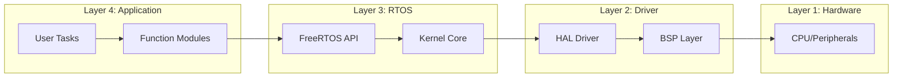

---

## 3. 任务设计与调度

### 3.1 任务配置

| 任务名称 | 优先级 | 栈大小 | 周期 | 功能描述 |
|---------|--------|--------|------|----------|
| NormalTask | osPriorityNormal (24) | 128 字 | 2ms | 主任务：LED/按键/IMU/告警 |
| DebugTask | osPriorityLow (22) | 256 字 | 20ms | 调试任务：日志输出 |
| CanCommTask | osPriorityHigh (26) | 256 字 | 1ms | CAN通信任务 |
| CaclulateTask | osPriorityAboveNormal (25) | 256 字 | 1ms | 计算任务：PID/CAN发送 |
| 空闲任务 | osPriorityIdle (0) | 128 字 | - | 系统空闲处理 |

### 3.2 任务创建流程

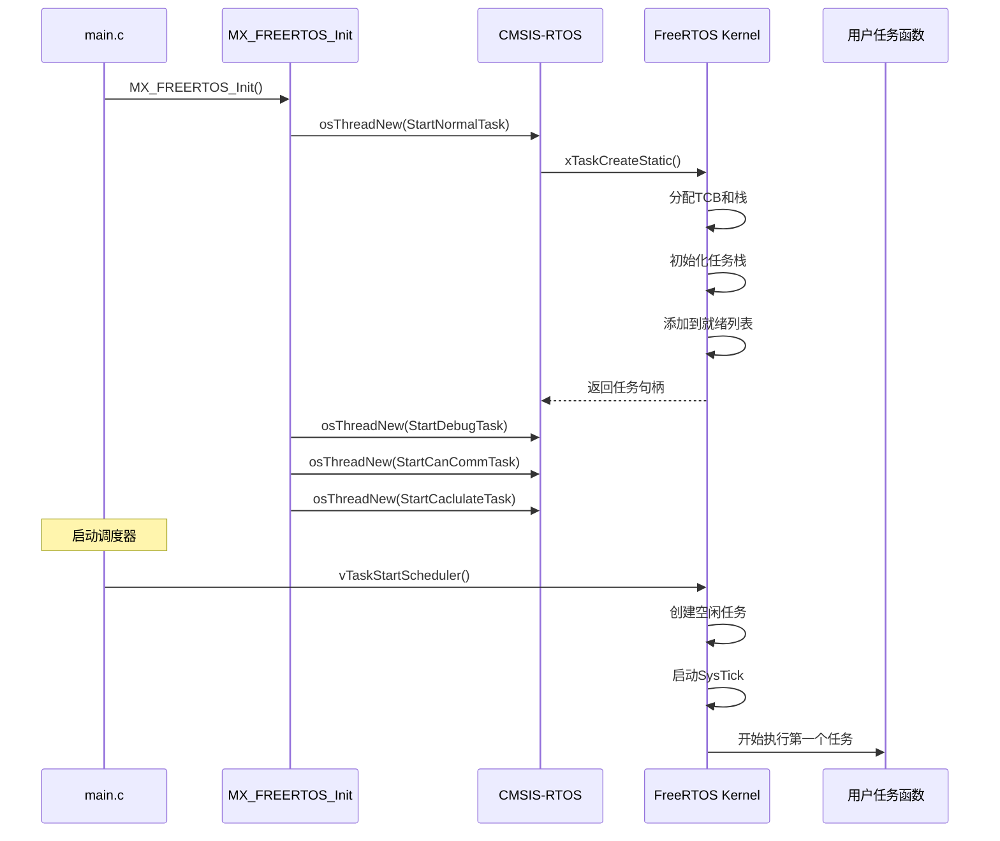

### 3.3 任务执行流程

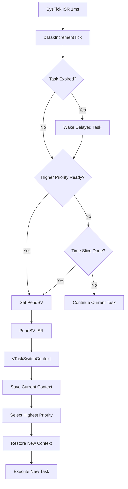

### 3.4 任务内部流程

```mermaid
flowchart TD
    subgraph NT["NormalTask (2ms)"]
        A1[StartNormalTask] --> B1[led_task_refresh]
        B1 --> C1[key_func_task]
        C1 --> D1[warning_task]
        D1 --> E1[KeyBaseTask]
        E1 --> F1[Uart_Process_Task]
        F1 --> G1[INS_task_Loop]
        G1 --> H1[DaemonTask]
        H1 --> I1[vTaskDelay 2ms]
        I1 --> A1
    end
    
    subgraph CT["CanCommTask (1ms)"]
        A2[StartCanCommTask] --> B2[vTaskDelayUntil 1ms]
        B2 --> C2[Gimbal_Task]
        C2 --> D2[FDCAN_Server_Task]
        D2 --> A2
    end
    
    subgraph CALC["CaclulateTask (1ms)"]
        A3[StartCaclulateTask] --> B3[vTaskDelayUntil 1ms]
        B3 --> C3[GimbalPidLoop]
        C3 --> D3[CANCommSendData]
        D3 --> E3[CANCommGetData]
        E3 --> F3[CANCommSendFlush]
        F3 --> A3
    end
```

---

## 4. 模块调用关系

### 4.1 模块依赖图

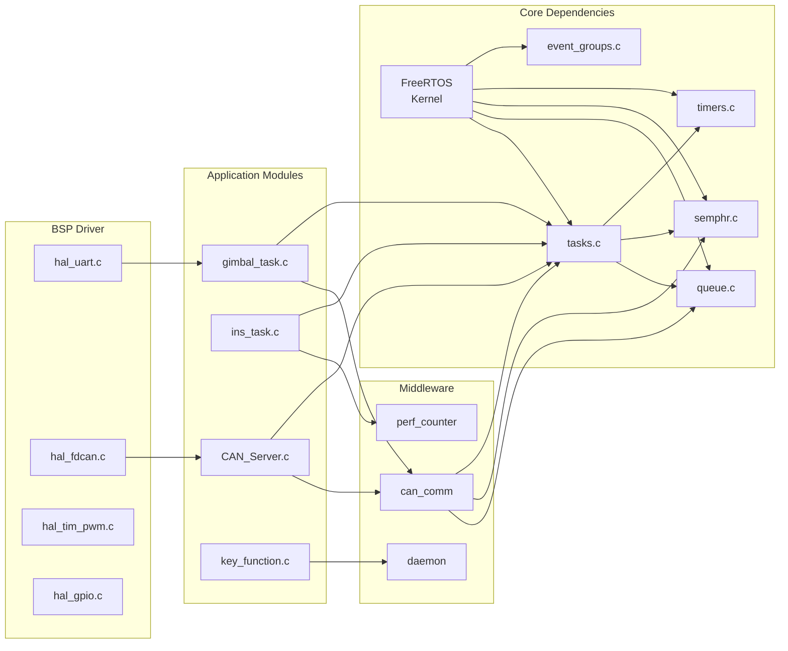

### 4.2 CAN 通信模块调用链

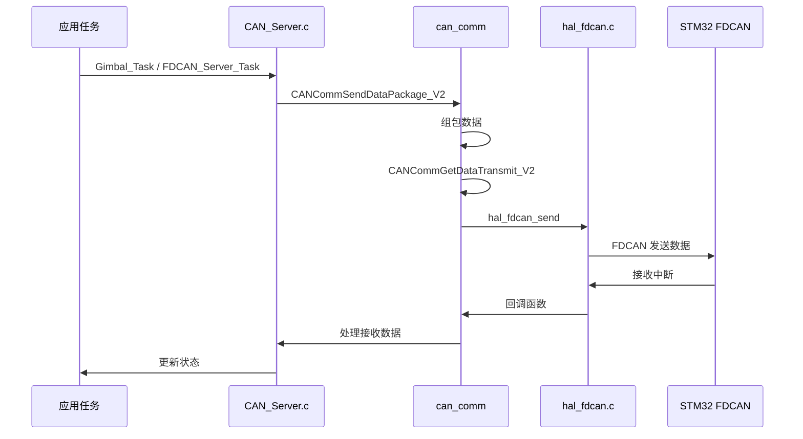

### 4.3 云台控制模块调用链

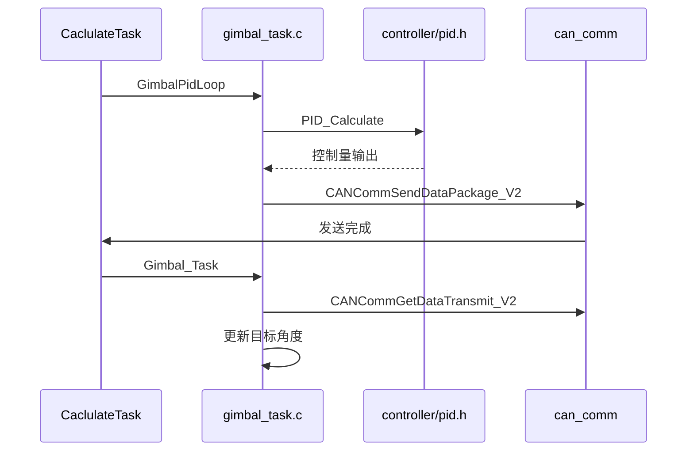

---

## 5. 中断与调度器交互

### 5.1 中断层次

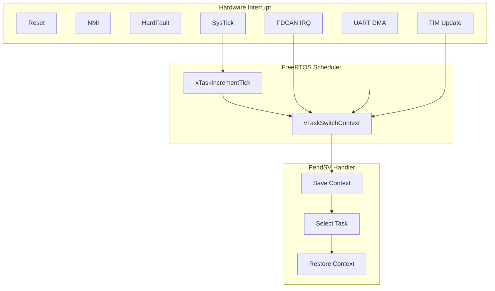

### 5.2 中断处理流程

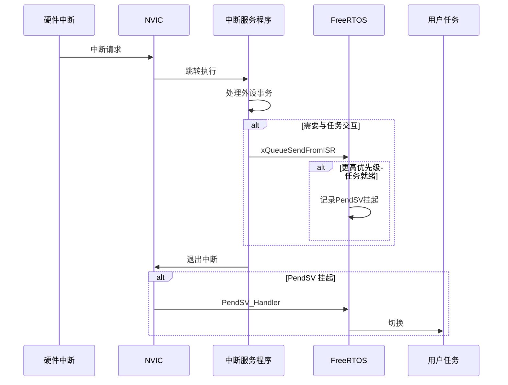

---

## 6. 同步与通信机制

### 6.1 任务间通信方式

| 通信方式 | 使用场景 | 典型应用 |
|---------|---------|----------|
| 消息队列 | 任务间数据传递 | CAN数据传递 |
| 信号量 | 资源访问控制 | 外设独占访问 |
| 互斥量 | 共享资源保护 | 全局变量保护 |
| 事件组 | 多条件同步 | 多事件组合触发 |
| 任务通知 | 快速单向通知 | 标志位传递 |

### 6.2 队列使用示例

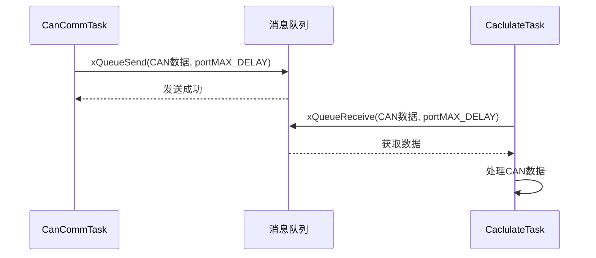

### 6.3 守护进程机制

本项目使用守护进程（Daemon）监控任务运行状态：

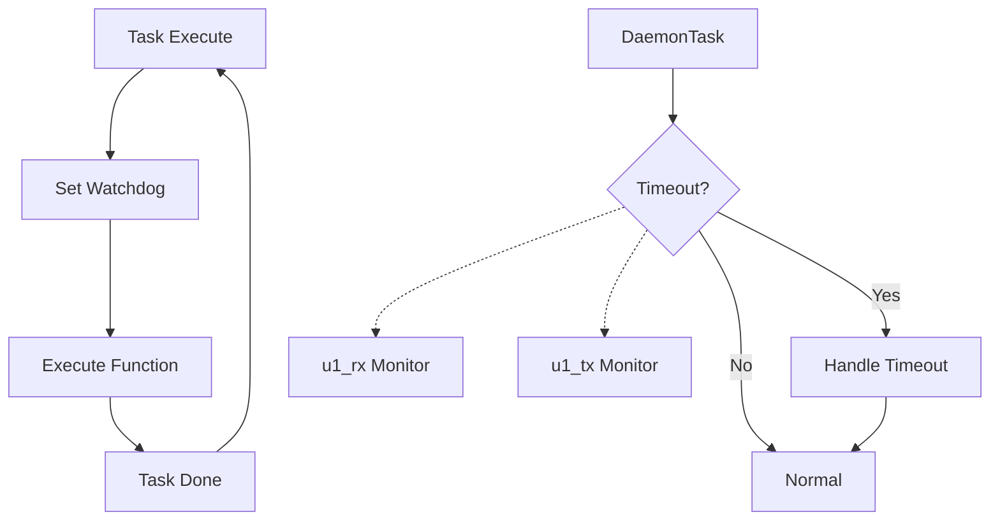

---

## 7. 内存管理

### 7.1 堆内存配置

```c
// FreeRTOSConfig.h
#define configTOTAL_HEAP_SIZE    ((size_t)3072)  // 3KB 堆空间
#define configMINIMAL_STACK_SIZE ((uint16_t)128) // 最小栈 128*4=512字节
```

### 7.2 内存分配策略

| 分配方式 | 配置 | 使用场景 |
|---------|------|----------|
| 静态分配 | configSUPPORT_STATIC_ALLOCATION=1 | 任务TCB/栈 |
| 动态分配 | configSUPPORT_DYNAMIC_ALLOCATION=1 | 队列/信号量 |

### 7.3 内存布局

```
┌─────────────────────────────────────────────────────────────┐
│                    STM32G431xx 内存布局                     │
├─────────────────────────────────────────────────────────────┤
│                                                             │
│  Flash (128KB)                                             │
│  ├─ 程序代码区                                              │
│  ├─ 只读数据区                                              │
│  └─ 向量表                                                  │
│                                                             │
├─────────────────────────────────────────────────────────────┤
│  SRAM (32KB)                                               │
│  ├─ .data (已初始化全局变量)                                 │
│  ├─ .bss (未初始化全局变量)                                  │
│  ├─ Heap (动态分配 - 3KB)                                   │
│  │   └─ 消息队列/信号量/事件组                              │
│  └─ Stack (主堆栈)                                          │
│                                                             │
├─────────────────────────────────────────────────────────────┤
│  Task Stack (任务栈 - 每个任务独立)                          │
│  ├─ NormalTask: 128字 = 512字节                            │
│  ├─ DebugTask: 256字 = 1KB                                 │
│  ├─ CanCommTask: 256字 = 1KB                               │
│  ├─ CaclulateTask: 256字 = 1KB                             │
│  └─ IdleTask: 128字 = 512字节                               │
│                                                             │
└─────────────────────────────────────────────────────────────┘
```

---

## 8. 时间管理

### 8.1 系统时钟配置

```c
// FreeRTOSConfig.h
#define configCPU_CLOCK_HZ    (SystemCoreClock)  // 170MHz
#define configTICK_RATE_HZ   ((TickType_t)1000)  // 1ms tick
```

### 8.2 定时器任务

| 定时器 | 周期 | 功能 |
|--------|------|------|
| timer_ledTask | 5ms | LED刷新/按键/IMU |
| timer_uartTask | 20ms | 串口发送/日志 |
| timer_driverTask | 1ms | 云台/CAN服务 |

---

## 9. 系统初始化流程

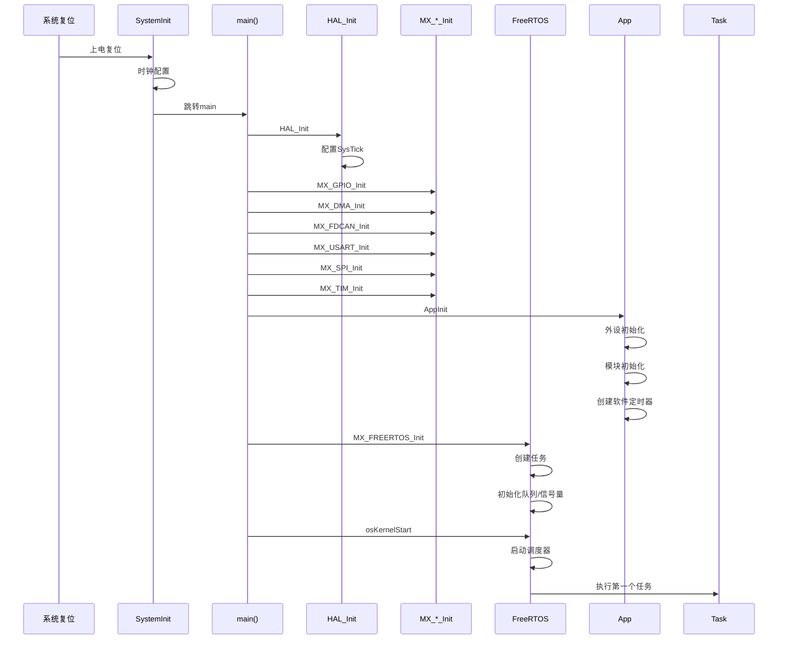

---

## 10. 关键文件索引

### 10.1 项目源文件

| 文件路径 | 功能描述 |
|---------|----------|
| [Core/Src/main.c](Core/Src/main.c) | 系统入口 |
| [Core/Src/app_freertos.c](Core/Src/app_freertos.c) | FreeRTOS 初始化与任务创建 |
| [applications/app.c](applications/app.c) | 应用初始化与主逻辑 |
| [Core/Inc/FreeRTOSConfig.h](Core/Inc/FreeRTOSConfig.h) | FreeRTOS 配置 |

### 10.2 FreeRTOS 内核文件

| 文件路径 | 功能描述 |
|---------|----------|
| [Middlewares/Third_Party/FreeRTOS/Source/tasks.c](Middlewares/Third_Party/FreeRTOS/Source/tasks.c) | 任务管理核心 |
| [Middlewares/Third_Party/FreeRTOS/Source/queue.c](Middlewares/Third_Party/FreeRTOS/Source/queue.c) | 消息队列 |
| [Middlewares/Third_Party/FreeRTOS/Source/semphr.c](Middlewares/Third_Party/FreeRTOS/Source/semphr.c) | 信号量/互斥量 |
| [Middlewares/Third_Party/FreeRTOS/Source/timers.c](Middlewares/Third_Party/FreeRTOS/Source/timers.c) | 软件定时器 |
| [Middlewares/Third_Party/FreeRTOS/Source/event_groups.c](Middlewares/Third_Party/FreeRTOS/Source/event_groups.c) | 事件组 |
| [Middlewares/Third_Party/FreeRTOS/Source/stream_buffer.c](Middlewares/Third_Party/FreeRTOS/Source/stream_buffer.c) | 流缓冲区 |
| [Middlewares/Third_Party/FreeRTOS/Source/portable/GCC/ARM_CM4F/port.c](Middlewares/Third_Party/FreeRTOS/Source/portable/GCC/ARM_CM4F/port.c) | 硬件端口实现 |
| [Middlewares/Third_Party/FreeRTOS/Source/portable/MemMang/heap_4.c](Middlewares/Third_Party/FreeRTOS/Source/portable/MemMang/heap_4.c) | 内存管理 |

### 10.3 应用任务文件

| 文件路径 | 功能描述 |
|---------|----------|
| [applications/gimbal_task.c](applications/gimbal_task.c) | 云台控制任务 |
| [applications/ins_task.c](applications/ins_task.c) | IMU 姿态解算任务 |
| [applications/CAN_Server.c](applications/CAN_Server.c) | CAN 通信服务 |
| [applications/key_function.c](applications/key_function.c) | 按键处理 |
| [applications/warning_task.c](applications/warning_task.c) | 告警任务 |
| [applications/usart_receive.c](applications/usart_receive.c) | 串口接收 |
| [applications/WS2812_*.c](applications/WS2812_SPI.c) | LED 控制 |

---

## 11. 总结

### 11.1 系统特点

1. **多任务协同**: 4个用户任务分工明确，通过消息队列和信号量进行通信同步
2. **实时性保证**: CAN通信和计算任务采用1ms周期，优先确保关键控制
3. **可靠性设计**: 守护进程监控任务运行，看门狗机制防止任务死锁
4. **模块化设计**: 清晰的分层架构，便于维护和扩展

### 11.2 性能指标

| 指标 | 数值 |
|------|------|
| 系统时钟频率 | 170MHz |
| Tick 频率 | 1kHz |
| 任务切换时间 | < 10μs |
| 堆内存使用 | 3KB |
| 总栈空间 | ~4KB |

---

## 参考资料

- [FreeRTOS 官方文档](http://www.FreeRTOS.org)
- [STM32G4xx HAL 库文档](https://www.st.com/)
- [本项目 FreeRTOS 分析文档](tasks.c_深度分析.md)
