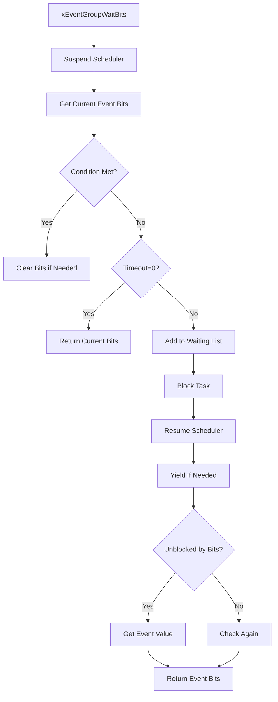
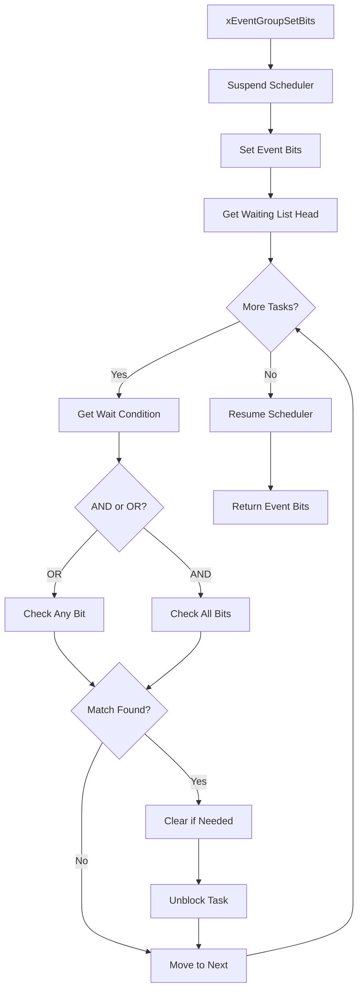
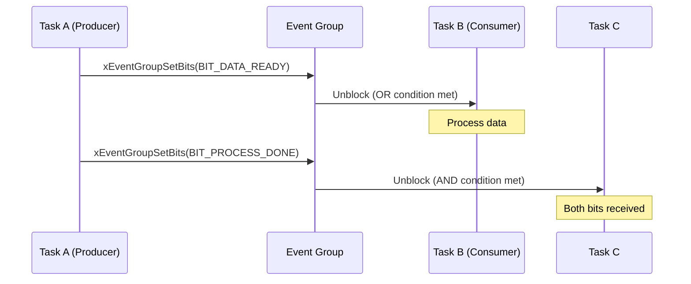
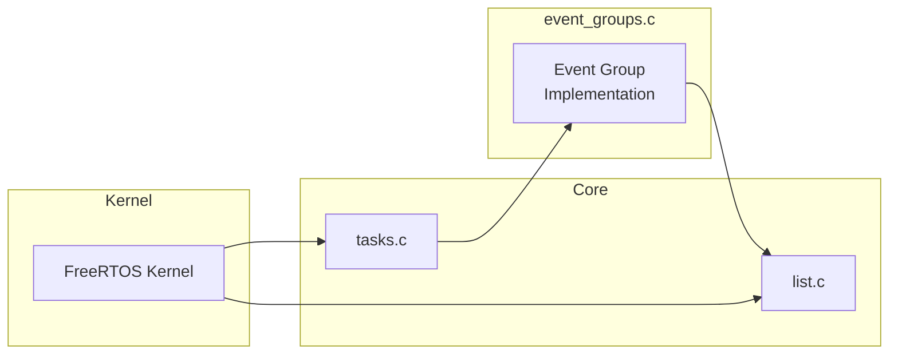

# FreeRTOS event_groups.c / event_groups.h 深度分析

## 文档信息

| 项目 | 内容 |
|------|------|
| 文件名 | event_groups.c / event_groups.h |
| 所属组件 | FreeRTOS Kernel |
| 版本 | V10.3.1 |
| 功能描述 | 事件组实现，多任务同步机制 |
| 分析日期 | 2026-02-23 |

---

## 1. 概述

[`event_groups.c`](Middlewares/Third_Party/FreeRTOS/Source/event_groups.c) 和 [`event_groups.h`](Middlewares/Third_Party/FreeRTOS/Source/include/event_groups.h) 是 FreeRTOS 的**事件组实现**，提供了一种高效的多任务同步机制。事件组允许任务等待特定位被设置，或在特定位被设置时通知其他任务。

### 1.1 核心特性

- ✅ 支持多位标志位同步
- ✅ 支持"与"（AND）和"或"（OR）等待条件
- ✅ 可从任务和中断中设置事件位
- ✅ 阻塞超时机制
- ✅ 支持静态/动态内存分配

---

## 2. 数据结构

### 2.1 事件组结构

```c
typedef struct EventGroupDef_t
{
    // 事件位（最多 24 位可用）
    EventBits_t uxEventBits;
    
    // 等待事件位的任务链表
    List_t xTasksWaitingForBits;
    
    #if( configUSE_TRACE_FACILITY == 1 )
        UBaseType_t uxEventGroupNumber;
    #endif
    
    #if( ( configSUPPORT_STATIC_ALLOCATION == 1 ) && ( configSUPPORT_DYNAMIC_ALLOCATION == 1 ) )
        uint8_t ucStaticallyAllocated;
    #endif
} EventGroup_t;
```

### 2.2 控制位定义

```c
// 控制位定义（用于内部管理，不对用户开放）
#define eventCLEAR_EVENTS_ON_EXIT_BIT    0x01000000UL  // 退出时清除事件位
#define eventUNBLOCKED_DUE_TO_BIT_SET   0x02000000UL  // 因事件位置位而解锁
#define eventWAIT_FOR_ALL_BITS          0x04000000UL  // 等待所有位
#define eventEVENT_BITS_CONTROL_BYTES    0xff000000UL  // 控制位掩码
```

### 2.3 内存布局图

```
┌─────────────────────────────────────────────────────────────┐
│                 EventGroup_t 内存布局                       │
├─────────────────────────────────────────────────────────────┤
│                                                             │
│  EventGroup_t 结构体                                        │
│  ┌─────────────────────────────────────────────┐          │
│  │ uxEventBits (32-bit)                        │          │
│  │  Bit 0  - 用户事件位                        │          │
│  │  Bit 1  - 用户事件位                        │          │
│  │  ...                                        │          │
│  │  Bit 23 - 用户事件位                        │          │
│  │  Bit 24 - 控制位 (CLEAR_ON_EXIT)            │          │
│  │  Bit 25 - 控制位 (UNBLOCKED_DUE_TO_BIT_SET) │          │
│  │  Bit 26 - 控制位 (WAIT_FOR_ALL)            │          │
│  │  Bit 27-31 - 保留                          │          │
│  ├─────────────────────────────────────────────┤          │
│  │ xTasksWaitingForBits (List_t)              │ ← 等待队列 │
│  │  - uxNumberOfItems                         │          │
│  │  - pxIndex                                 │          │
│  │  - xListEnd                                │          │
│  └─────────────────────────────────────────────┘          │
│                                                             │
└─────────────────────────────────────────────────────────────┘
```

---

## 3. 核心 API 函数

### 3.1 创建事件组

```c
// 动态创建（常用）
EventGroupHandle_t xEventGroupCreate( void )
{
    EventGroup_t *pxEventBits;
    
    // 分配内存
    pxEventBits = ( EventGroup_t * ) pvPortMalloc( sizeof( EventGroup_t ) );
    
    if( pxEventBits != NULL )
    {
        // 初始化事件位
        pxEventBits->uxEventBits = 0;
        
        // 初始化等待链表
        vListInitialise( &( pxEventBits->xTasksWaitingForBits ) );
        
        #if( configSUPPORT_DYNAMIC_ALLOCATION == 1 )
            pxEventBits->ucStaticallyAllocated = pdFALSE;
        #endif
        
        traceEVENT_GROUP_CREATE( pxEventBits );
    }
    else
    {
        traceEVENT_GROUP_CREATE_FAILED();
    }
    
    return ( EventGroupHandle_t ) pxEventBits;
}
```

### 3.2 等待事件位

```c
EventBits_t xEventGroupWaitBits( 
    EventGroupHandle_t xEventGroup,           // 事件组句柄
    const EventBits_t uxBitsToWaitFor,       // 要等待的事件位
    const BaseType_t xClearOnExit,           // 退出时是否清除位
    const BaseType_t xWaitForAllBits,        // pdTRUE:AND / pdFALSE:OR
    TickType_t xTicksToWait )               // 等待超时
{
    EventGroup_t *pxEventBits = xEventGroup;
    EventBits_t uxReturn, uxControlBits = 0;
    BaseType_t xWaitConditionMet;
    
    // 进入临界区
    vTaskSuspendAll();
    {
        // 获取当前事件位
        const EventBits_t uxCurrentEventBits = pxEventBits->uxEventBits;
        
        // 检查等待条件是否已满足
        xWaitConditionMet = prvTestWaitCondition(
            uxCurrentEventBits, 
            uxBitsToWaitFor, 
            xWaitForAllBits );
        
        if( xWaitConditionMet != pdFALSE )
        {
            // 条件已满足，直接返回
            uxReturn = uxCurrentEventBits;
            xTicksToWait = 0;
            
            if( xClearOnExit != pdFALSE )
            {
                pxEventBits->uxEventBits &= ~uxBitsToWaitFor;
            }
        }
        else if( xTicksToWait == 0 )
        {
            // 无阻塞时间，直接返回
            uxReturn = uxCurrentEventBits;
        }
        else
        {
            // 需要阻塞等待
            if( xClearOnExit != pdFALSE )
                uxControlBits |= eventCLEAR_EVENTS_ON_EXIT_BIT;
            
            if( xWaitForAllBits != pdFALSE )
                uxControlBits |= eventWAIT_FOR_ALL_BITS;
            
            // 将任务添加到等待列表并阻塞
            vTaskPlaceOnUnorderedEventList( 
                &( pxEventBits->xTasksWaitingForBits ),
                uxBitsToWaitFor | uxControlBits,
                xTicksToWait );
            
            uxReturn = 0;
        }
    }
    xTaskResumeAll();
    
    // 触发任务切换
    if( xTicksToWait != 0 )
    {
        portYIELD_WITHIN_API();
        // 恢复执行后获取结果
        uxReturn = uxTaskResetEventItemValue();
    }
    
    return uxReturn;
}
```

### 3.3 设置事件位（任务中）

```c
EventBits_t xEventGroupSetBits( 
    EventGroupHandle_t xEventGroup,
    const EventBits_t uxBitsToSet )
{
    ListItem_t *pxListItem, *pxNext;
    EventGroup_t *pxEventBits = xEventGroup;
    EventBits_t uxBitsToClear = 0, uxBitsWaitedFor, uxControlBits;
    BaseType_t xMatchFound = pdFALSE;
    
    // 挂起调度器
    vTaskSuspendAll();
    {
        // 设置事件位
        pxEventBits->uxEventBits |= uxBitsToSet;
        
        // 遍历等待队列，检查是否有任务满足条件
        pxListItem = listGET_HEAD_ENTRY( &( pxEventBits->xTasksWaitingForBits ) );
        
        while( pxListItem != listGET_END_MARKER( &( pxEventBits->xTasksWaitingForBits ) ) )
        {
            pxNext = listGET_NEXT( pxListItem );
            uxBitsWaitedFor = listGET_LIST_ITEM_VALUE( pxListItem );
            
            // 分离控制位和等待位
            uxControlBits = uxBitsWaitedFor & eventEVENT_BITS_CONTROL_BYTES;
            uxBitsWaitedFor &= ~eventEVENT_BITS_CONTROL_BYTES;
            
            // 检查等待条件
            if( ( uxControlBits & eventWAIT_FOR_ALL_BITS ) == 0 )
            {
                // OR 条件：任一位满足即可
                if( ( uxBitsWaitedFor & pxEventBits->uxEventBits ) != 0 )
                    xMatchFound = pdTRUE;
            }
            else
            {
                // AND 条件：所有位都满足
                if( ( uxBitsWaitedFor & pxEventBits->uxEventBits ) == uxBitsWaitedFor )
                    xMatchFound = pdTRUE;
            }
            
            // 满足条件，解除任务阻塞
            if( xMatchFound != pdFALSE )
            {
                if( ( uxControlBits & eventCLEAR_EVENTS_ON_EXIT_BIT ) != 0 )
                    uxBitsToClear |= uxBitsWaitedFor;
                
                vTaskRemoveFromUnorderedEventList(
                    pxListItem,
                    pxEventBits->uxEventBits | eventUNBLOCKED_DUE_TO_BIT_SET );
            }
            
            pxListItem = pxNext;
        }
        
        // 清除需要清除的位
        pxEventBits->uxEventBits &= ~uxBitsToClear;
    }
    xTaskResumeAll();
    
    return pxEventBits->uxEventBits;
}
```

### 3.4 设置事件位（中断中）

```c
EventBits_t xEventGroupSetBitsFromISR( 
    EventGroupHandle_t xEventGroup,
    const EventBits_t uxBitsToSet,
    BaseType_t *pxHigherPriorityTaskWoken )
{
    EventBits_t uxReturn;
    
    // 使用基线 API 设置位
    uxReturn = xEventGroupSetBits( xEventGroup, uxBitsToSet );
    
    // 检查是否需要唤醒高优先级任务
    if( uxReturn & eventUNBLOCKED_DUE_TO_BIT_SET )
    {
        *pxHigherPriorityTaskWoken = pdTRUE;
    }
    
    return uxReturn;
}
```

---

## 4. 等待条件判断

### 4.1 条件判断函数

```c
static BaseType_t prvTestWaitCondition( 
    const EventBits_t uxCurrentEventBits,
    const EventBits_t uxBitsToWaitFor,
    const BaseType_t xWaitForAllBits )
{
    BaseType_t xReturn;
    
    if( xWaitForAllBits == pdFALSE )
    {
        // OR 条件：任一位被设置即满足
        if( ( uxCurrentEventBits & uxBitsToWaitFor ) != ( EventBits_t ) 0 )
        {
            xReturn = pdTRUE;
        }
        else
        {
            xReturn = pdFALSE;
        }
    }
    else
    {
        // AND 条件：所有位都被设置才满足
        if( ( uxCurrentEventBits & uxBitsToWaitFor ) == uxBitsToWaitFor )
        {
            xReturn = pdTRUE;
        }
        else
        {
            xReturn = pdFALSE;
        }
    }
    
    return xReturn;
}
```

---

## 5. 工作流程图

### 5.1 等待事件位流程



### 5.2 设置事件位流程



---

## 6. 使用示例

### 6.1 基本用法

```c
// 创建事件组
EventGroupHandle_t xEventGroup = xEventGroupCreate();

// 任务A：等待事件位
void vTaskA( void *pvParameters )
{
    EventBits_t uxBits;
    
    for( ;; )
    {
        // 等待 Bit0 或 Bit1 被设置（OR 条件）
        uxBits = xEventGroupWaitBits(
            xEventGroup,
            BIT_0 | BIT_1,           // 等待的位
            pdTRUE,                  // 退出时清除
            pdFALSE,                 // OR 条件
            portMAX_DELAY );
        
        // 处理事件
        if( uxBits & BIT_0 )
        {
            // Bit0 被设置
        }
    }
}

// 任务B：设置事件位
void vTaskB( void *pvParameters )
{
    for( ;; )
    {
        // 设置 Bit0
        xEventGroupSetBits( xEventGroup, BIT_0 );
        
        vTaskDelay( 100 );
    }
}
```

### 6.2 多任务同步示例



---

## 7. 与其他模块的关系

### 7.1 模块依赖图



### 7.2 调用关系表

| 函数 | 调用者 | 用途 |
|------|--------|------|
| `xEventGroupCreate()` | 应用任务 | 创建事件组 |
| `xEventGroupWaitBits()` | 应用任务 | 等待事件位 |
| `xEventGroupSetBits()` | 应用任务/ISR | 设置事件位 |
| `xEventGroupSetBitsFromISR()` | 中断服务程序 | 中断中设置事件位 |
| `xEventGroupSync()` | 应用任务 | 同步事件位 |
| `vEventGroupDelete()` | 应用任务 | 删除事件组 |

---

## 8. 事件位操作说明

### 8.1 位操作规则

```
┌────────────────────────────────────────────────────────────────┐
│                    事件位使用规则                               │
├────────────────────────────────────────────────────────────────┤
│                                                                │
│  用户可用位: Bit 0 - Bit 23 (共 24 位)                        │
│                                                                │
│  控制位 (内核使用，不应手动操作):                              │
│  ├─ Bit 24: eventCLEAR_EVENTS_ON_EXIT_BIT                    │
│  ├─ Bit 25: eventUNBLOCKED_DUE_TO_BIT_SET                   │
│  ├─ Bit 26: eventWAIT_FOR_ALL_BITS                          │
│  └─ Bit 27-31: 保留                                          │
│                                                                │
│  注意事项:                                                     │
│  1. 不要在 uxBitsToWaitFor 中包含控制位                       │
│  2. 使用 pdTRUE/pdFALSE 作为布尔参数                          │
│  3. 从中断中设置位使用 xEventGroupSetBitsFromISR()           │
│                                                                │
└────────────────────────────────────────────────────────────────┘
```

---

## 9. 关键函数索引

| 函数名 | 位置 | 功能 |
|--------|------|------|
| [`xEventGroupCreate()`](Middlewares/Third_Party/FreeRTOS/Source/event_groups.c:145) | event_groups.c:145 | 创建事件组 |
| [`xEventGroupCreateStatic()`](Middlewares/Third_Party/FreeRTOS/Source/event_groups.c:93) | event_groups.c:93 | 静态创建事件组 |
| [`xEventGroupWaitBits()`](Middlewares/Third_Party/FreeRTOS/Source/event_groups.c:311) | event_groups.c:311 | 等待事件位 |
| [`xEventGroupSetBits()`](Middlewares/Third_Party/FreeRTOS/Source/event_groups.c:519) | event_groups.c:519 | 设置事件位 |
| [`xEventGroupSetBitsFromISR()`](Middlewares/Third_Party/FreeRTOS/Source/event_groups.c:708) | event_groups.c:708 | 中断中设置事件位 |
| [`xEventGroupSync()`](Middlewares/Third_Party/FreeRTOS/Source/event_groups.c:450) | event_groups.c:450 | 同步事件位 |
| [`vEventGroupDelete()`](Middlewares/Third_Party/FreeRTOS/Source/event_groups.c:613) | event_groups.c:613 | 删除事件组 |

---

## 10. 性能特性

### 10.1 时间复杂度

| 操作 | 时间复杂度 | 说明 |
|------|-----------|------|
| `xEventGroupCreate` | O(1) | 创建事件组 |
| `xEventGroupWaitBits` | O(1) | 检查条件（不阻塞） |
| `xEventGroupSetBits` | O(n) | 遍历等待队列，n=等待任务数 |
| `xEventGroupSetBitsFromISR` | O(n) | 同上 |

### 10.2 内存开销

```
EventGroup_t:
  - uxEventBits: 4 bytes
  - xTasksWaitingForBits: ~24 bytes
  - Total: ~32 bytes per event group
```

---

## 11. 总结

`event_groups.c` 是 FreeRTOS 的**多任务同步机制**，适用于以下场景：

1. **多任务协调**: 多个任务需要等待同一个事件
2. **条件同步**: 等待多个条件中的任意一个（OR）或全部（AND）
3. **状态标志**: 轻量级的状态标志传递
4. **任务通知**: 替代任务通知的通用版本

事件组提供了一种灵活且高效的任务间通信方式，是 FreeRTOS 同步原语的重要组成部分。

---

## 参考资料

- [FreeRTOS 官方文档](http://www.FreeRTOS.org)
- [event_groups.c 源码](Middlewares/Third_Party/FreeRTOS/Source/event_groups.c)
- [event_groups.h 源码](Middlewares/Third_Party/FreeRTOS/Source/include/event_groups.h)
- [tasks.c 深度分析](tasks.c_深度分析.md)
- [list.c 深度分析](list.c_深度分析.md)
