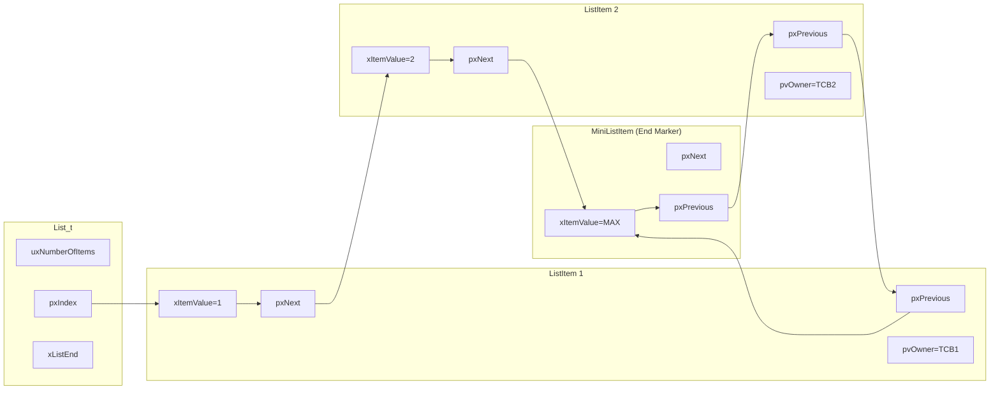
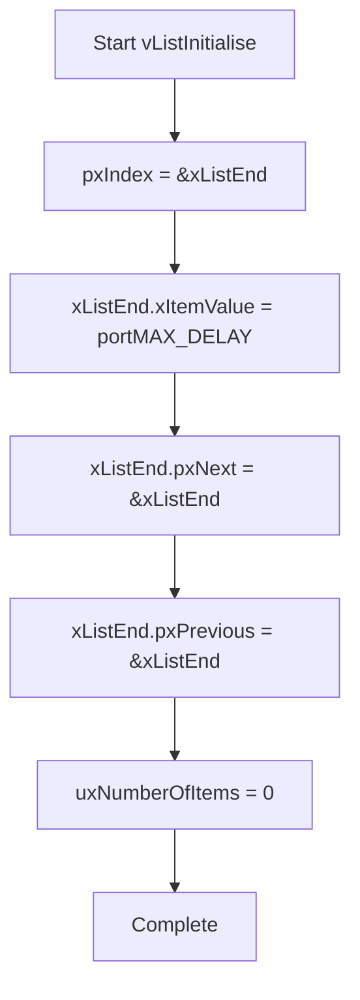
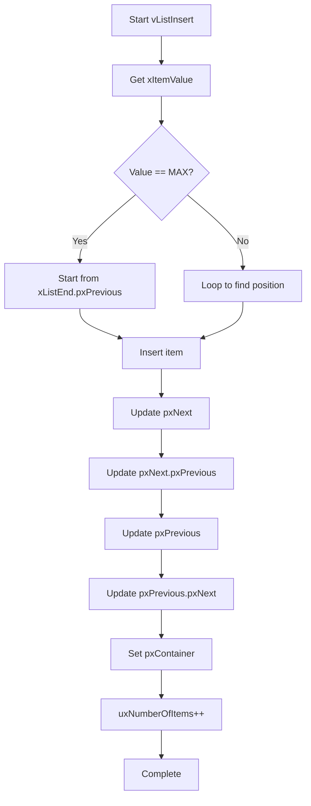
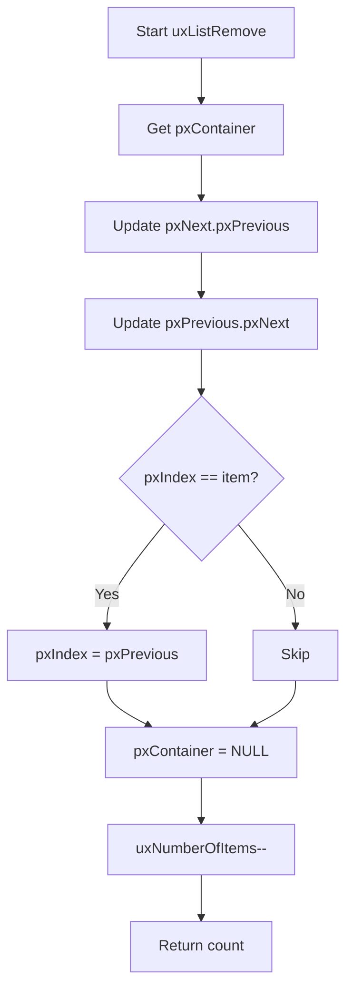
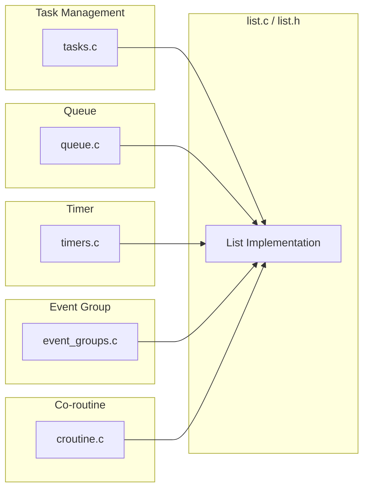
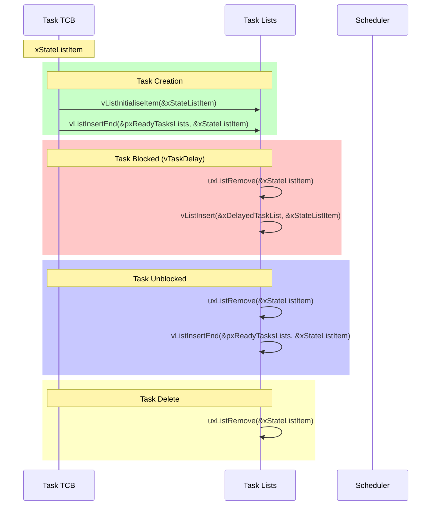
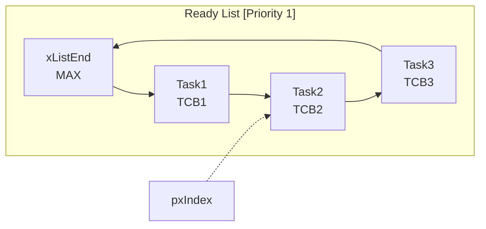

# FreeRTOS list.c / list.h 深度分析

## 文档信息

| 项目 | 内容 |
|------|------|
| 文件名 | list.c / list.h |
| 所属组件 | FreeRTOS Kernel |
| 版本 | V10.3.1 |
| 功能描述 | 双向链表实现，FreeRTOS 核心数据结构 |
| 分析日期 | 2026-02-23 |

---

## 1. 概述

[`list.c`](Middlewares/Third_Party/FreeRTOS/Source/list.c) 和 [`list.h`](Middlewares/Third_Party/FreeRTOS/Source/include/list.h) 是 FreeRTOS 的**核心数据结构实现**，提供了双向链表（Double Linked List）功能。FreeRTOS 内核大量使用链表来管理任务状态、消息队列、事件组等，是整个操作系统的"血管"。

### 1.1 核心特性

- ✅ 双向循环链表
- ✅ 插入排序支持（按 xItemValue 排序）
- ✅ O(1) 时间复杂度的插入/删除
- ✅ 数据完整性检查选项
- ✅ 零额外内存开销（使用链表节点作为链表末端标记）

---

## 2. 数据结构

### 2.1 链表项结构（ListItem_t）

```c
struct xLIST_ITEM
{
    // 完整性检查值（可选）
    TickType_t xListItemIntegrityValue1;
    
    // 链表项的值，用于排序
    configLIST_VOLATILE TickType_t xItemValue;
    
    // 指向下一个链表项
    struct xLIST_ITEM * configLIST_VOLATILE pxNext;
    
    // 指向上一个链表项
    struct xLIST_ITEM * configLIST_VOLATILE pxPrevious;
    
    // 指向拥有此链表项的对象（通常是 TCB）
    void * pvOwner;
    
    // 指向所属链表
    struct xLIST * configLIST_VOLATILE pxContainer;
    
    TickType_t xListItemIntegrityValue2;
};
```

### 2.2 链表结构（List_t）

```c
typedef struct xLIST
{
    // 完整性检查值（可选）
    TickType_t xListIntegrityValue1;
    
    // 链表中的项数
    volatile UBaseType_t uxNumberOfItems;
    
    // 索引指针，用于遍历链表
    ListItem_t * configLIST_VOLATILE pxIndex;
    
    // 链表末端标记（使用 MiniListItem_t 节省内存）
    MiniListItem_t xListEnd;
    
    TickType_t xListIntegrityValue2;
} List_t;
```

### 2.3 内存布局图

```
┌─────────────────────────────────────────────────────────────────────┐
│                    链表内存布局                                      │
├─────────────────────────────────────────────────────────────────────┤
│                                                                     │
│  List_t 结构体                                                      │
│  ┌──────────────────────────────────────┐                         │
│  │ uxNumberOfItems = 3                  │                         │
│  │ pxIndex ──────────────────────────┐   │                         │
│  └──────────────────────────────────┼───┘                         │
│                                    │                               │
│  xListEnd (MiniListItem_t)         ▼                               │
│  ┌────────────────────────────────────────┐                       │
│  │ xItemValue = portMAX_DELAY (最大值)    │ ← 始终在链表末尾      │
│  │ pxNext ────────────────────────────┐   │                       │
│  │ pxPrevious ───────────────────────┼───┘                       │
│  └──────────────────────────────────┼─────► ...                  │
│                                     │                             │
│  实际链表项 1 (TCB1 的 xStateListItem)                            │
│  ┌────────────────────────────────────────┐                       │
│  │ xItemValue = 1                         │                       │
│  │ pxNext ────────────────────────────┐   │                       │
│  │ pxPrevious ───────────────────────┼───┘                       │
│  │ pvOwner = &TCB1                     │ ← 指向任务控制块         │
│  │ pxContainer = &pxReadyTasksLists[1] │ ← 属于就绪列表          │
│  └──────────────────────────────────┼─────►                     │
│                                     │                             │
│  实际链表项 2 (TCB2 的 xStateListItem)                            │
│  ┌────────────────────────────────────────┐                       │
│  │ xItemValue = 2                         │                       │
│  │ pxNext ────────────────────────────┐   │                       │
│  │ pxPrevious ───────────────────────┼───┘                       │
│  │ pvOwner = &TCB2                     │                           │
│  │ pxContainer = &pxReadyTasksLists[1] │                           │
│  └──────────────────────────────────────┘                         │
│                                                                     │
└─────────────────────────────────────────────────────────────────────┘
```

### 2.4 链表结构图



---

## 3. 核心 API 函数

### 3.1 链表初始化

```c
// 初始化链表
void vListInitialise( List_t * const pxList )
{
    // xListEnd 作为链表末端标记
    pxList->pxIndex = ( ListItem_t * ) &( pxList->xListEnd );
    
    // 末端值最大，确保在链表末尾
    pxList->xListEnd.xItemValue = portMAX_DELAY;
    
    // 循环指向自己，表示空链表
    pxList->xListEnd.pxNext = ( ListItem_t * ) &( pxList->xListEnd );
    pxList->xListEnd.pxPrevious = ( ListItem_t * ) &( pxList->xListEnd );
    
    pxList->uxNumberOfItems = 0U;
}
```

### 3.2 链表项初始化

```c
// 初始化链表项
void vListInitialiseItem( ListItem_t * const pxItem )
{
    // 标记为未在任何链表中
    pxItem->pxContainer = NULL;
}
```

### 3.3 插入函数对比

| 函数 | 时间复杂度 | 用途 |
|------|-----------|------|
| `vListInsertEnd()` | O(1) | 插入到链表末尾（FIFO） |
| `vListInsert()` | O(n) | 按值排序插入 |

#### 3.3.1 末尾插入

```c
// 在链表末尾插入（不排序）
void vListInsertEnd( List_t * const pxList, ListItem_t * const pxNewListItem )
{
    ListItem_t * const pxIndex = pxList->pxIndex;
    
    // 插入新项
    pxNewListItem->pxNext = pxIndex;
    pxNewListItem->pxPrevious = pxIndex->pxPrevious;
    
    pxIndex->pxPrevious->pxNext = pxNewListItem;
    pxIndex->pxPrevious = pxNewListItem;
    
    // 记录所属链表
    pxNewListItem->pxContainer = pxList;
    
    ( pxList->uxNumberOfItems )++;
}
```

#### 3.3.2 排序插入

```c
// 按 xItemValue 排序插入
void vListInsert( List_t * const pxList, ListItem_t * const pxNewListItem )
{
    ListItem_t *pxIterator;
    const TickType_t xValueOfInsertion = pxNewListItem->xItemValue;
    
    // 查找插入位置（升序遍历）
    for( pxIterator = ( ListItem_t * ) &( pxList->xListEnd ); 
         pxIterator->pxNext->xItemValue <= xValueOfInsertion; 
         pxIterator = pxIterator->pxNext )
    {
        // 寻找正确位置
    }
    
    // 插入新项
    pxNewListItem->pxNext = pxIterator->pxNext;
    pxNewListItem->pxNext->pxPrevious = pxNewListItem;
    pxNewListItem->pxPrevious = pxIterator;
    pxIterator->pxNext = pxNewListItem;
    
    pxNewListItem->pxContainer = pxList;
    ( pxList->uxNumberOfItems )++;
}
```

### 3.4 删除函数

```c
// 从链表中删除项
UBaseType_t uxListRemove( ListItem_t * const pxItemToRemove )
{
    List_t * const pxList = pxItemToRemove->pxContainer;
    
    // 从双向链表中移除
    pxItemToRemove->pxNext->pxPrevious = pxItemToRemove->pxPrevious;
    pxItemToRemove->pxPrevious->pxNext = pxItemToRemove->pxNext;
    
    // 如果删除的是当前索引项，需要调整索引
    if( pxList->pxIndex == pxItemToRemove )
    {
        pxList->pxIndex = pxItemToRemove->pxPrevious;
    }
    
    // 标记为未在任何链表中
    pxItemToRemove->pxContainer = NULL;
    
    return ( pxList->uxNumberOfItems )--;
}
```

---

## 4. 链表操作流程图

### 4.1 初始化流程



### 4.2 插入流程



### 4.3 删除流程



---

## 5. 在 FreeRTOS 中的应用

### 5.1 任务管理

链表在 FreeRTOS 任务管理中扮演核心角色：

```c
// 任务控制块中的链表项
typedef struct tskTaskControlBlock
{
    volatile StackType_t *pxTopOfStack;
    ListItem_t xStateListItem;              // 任务状态链表项
    ListItem_t xEventListItem;              // 事件链表项
    UBaseType_t uxPriority;
    StackType_t *pxStack;
    char pcTaskName[ configMAX_TASK_NAME_LEN ];
    // ...
} tskTCB;
```

### 5.2 任务就绪列表

```c
// 每个优先级一个就绪列表
static List_t pxReadyTasksLists[ configMAX_PRIORITIES ];

// 添加任务到就绪列表
#define prvAddTaskToReadyList( pxTCB )\
    vListInsertEnd( &( pxReadyTasksLists[ ( pxTCB )->uxPriority ] ), \
                    &( ( pxTCB )->xStateListItem ) );
```

### 5.3 延迟任务列表

```c
// 延迟任务列表（两个用于处理溢出）
static List_t xDelayedTaskList1;
static List_t xDelayedTaskList2;
static List_t * volatile pxDelayedTaskList;
static List_t * volatile pxOverflowDelayedTaskList;

// 挂起任务列表
static List_t xSuspendedTaskList;

// 待删除任务列表
static List_t xTasksWaitingTermination;

// 待就绪任务列表（调度器挂起时使用）
static List_t xPendingReadyList;
```

---

## 6. 模块调用关系

### 6.1 调用链表的核心模块



### 6.2 具体调用场景

| 模块 | 使用场景 | 链表操作 |
|------|---------|----------|
| **tasks.c** | 任务调度 | `vListInitialise`, `vListInsertEnd`, `vListInsert`, `uxListRemove` |
| **queue.c** | 消息队列 | `vListInitialise` |
| **timers.c** | 软件定时器 | `vListInitialise`, `vListInitialiseItem`, `vListInsert`, `uxListRemove` |
| **event_groups.c** | 事件组 | `vListInitialise` |
| **croutine.c** | 协程 | `vListInitialise`, `vListInitialiseItem`, `vListInsertEnd`, `vListInsert`, `uxListRemove` |

### 6.3 任务状态转换中的链表操作



---

## 7. 时间片轮转实现

链表还用于实现同优先级任务的时间片轮转：

```c
// 遍历同一优先级的所有任务
#define listGET_OWNER_OF_NEXT_ENTRY( pxTCB, pxList )\
{\
    List_t * const pxConstList = ( pxList );\
    \
    /* 移动到下一个项 */\
    pxConstList->pxIndex = pxConstList->pxIndex->pxNext;\
    \
    /* 如果到达末尾，则回到开始 */\
    if( pxConstList->pxIndex == ( ListItem_t * ) &pxConstList->xListEnd )\
    {\
        pxConstList->pxIndex = pxConstList->pxIndex->pxNext;\
    }\
    \
    /* 获取任务控制块 */\
    pxTCB = pxConstList->pxIndex->pvOwner;\
}
```

### 7.1 时间片轮转示意图



```
第一次调用 listGET_OWNER_OF_NEXT_ENTRY:
  pxIndex: T1 → T2
  返回: Task1

第二次调用:
  pxIndex: T2 → T3
  返回: Task2

第三次调用:
  pxIndex: T3 → END → T1
  返回: Task3

第四次调用:
  pxIndex: T1 → T2
  返回: Task1
```

---

## 8. 关键宏定义

### 8.1 链表项访问宏

```c
// 设置链表项所有者
#define listSET_LIST_ITEM_OWNER( pxListItem, pxOwner )\
    ( ( pxListItem )->pvOwner = ( void * ) ( pxOwner ) )

// 获取链表项所有者
#define listGET_LIST_ITEM_OWNER( pxListItem )\
    ( ( pxListItem )->pvOwner )

// 设置链表项值
#define listSET_LIST_ITEM_VALUE( pxListItem, xValue )\
    ( ( pxListItem )->xItemValue = ( xValue ) )

// 获取链表项值
#define listGET_LIST_ITEM_VALUE( pxListItem )\
    ( ( pxListItem )->xItemValue )
```

### 8.2 链表操作宏

```c
// 检查链表是否为空
#define listLIST_IS_EMPTY( pxList )\
    ( ( ( pxList )->uxNumberOfItems == ( UBaseType_t ) 0 ) ? pdTRUE : pdFALSE )

// 获取链表项数
#define listCURRENT_LIST_LENGTH( pxList )\
    ( ( pxList )->uxNumberOfItems )

// 获取头部项的所有者
#define listGET_OWNER_OF_HEAD_ENTRY( pxList )\
    ( ( ( pxList )->xListEnd ).pxNext->pvOwner )

// 获取下一个项
#define listGET_NEXT( pxListItem )\
    ( ( pxListItem )->pxNext )
```

---

## 9. 性能特性

### 9.1 时间复杂度

| 操作 | 时间复杂度 | 说明 |
|------|-----------|------|
| `vListInitialise` | O(1) | 初始化空链表 |
| `vListInitialiseItem` | O(1) | 初始化链表项 |
| `vListInsertEnd` | O(1) | 末尾插入 |
| `vListInsert` | O(n) | 排序插入，需遍历 |
| `uxListRemove` | O(1) | 删除链表项 |
| `listGET_OWNER_OF_NEXT_ENTRY` | O(1) | 遍历下一个 |

### 9.2 内存开销

```
每个链表项开销:
- xItemValue: 4 字节 (TickType_t)
- pxNext: 4/8 字节 (指针)
- pxPrevious: 4/8 字节 (指针)
- pvOwner: 4/8 字节 (指针)
- pxContainer: 4/8 字节 (指针)
- 总计: 20-40 字节（取决于架构）
```

---

## 10. 数据完整性检查

### 10.1 配置选项

```c
// FreeRTOSConfig.h 中启用
#define configUSE_LIST_DATA_INTEGRITY_CHECK_BYTES 1
```

### 10.2 检查机制

启用后，链表结构体会额外添加两个检查值：

```c
// 链表结构体
typedef struct xLIST
{
    TickType_t xListIntegrityValue1;  // 检查值1
    volatile UBaseType_t uxNumberOfItems;
    ListItem_t * volatile pxIndex;
    MiniListItem_t xListEnd;
    TickType_t xListIntegrityValue2;  // 检查值2
} List_t;
```

初始化时设置为已知值，运行时检查是否被破坏。

---

## 11. 关键函数索引

| 函数名 | 位置 | 功能 |
|--------|------|------|
| [`vListInitialise()`](Middlewares/Third_Party/FreeRTOS/Source/list.c:37) | list.c:37 | 初始化链表 |
| [`vListInitialiseItem()`](Middlewares/Third_Party/FreeRTOS/Source/list.c:62) | list.c:62 | 初始化链表项 |
| [`vListInsertEnd()`](Middlewares/Third_Party/FreeRTOS/Source/list.c:74) | list.c:74 | 末尾插入 |
| [`vListInsert()`](Middlewares/Third_Party/FreeRTOS/Source/list.c:103) | list.c:103 | 排序插入 |
| [`uxListRemove()`](Middlewares/Third_Party/FreeRTOS/Source/list.c:170) | list.c:170 | 删除链表项 |

---

## 12. 总结

`list.c` 和 `list.h` 是 FreeRTOS 的**基础设施**，被所有内核模块广泛使用：

1. **任务管理**: 管理就绪任务、延迟任务、挂起任务
2. **队列管理**: 管理等待发送/接收的任务
3. **定时器管理**: 管理活跃定时器列表
4. **事件组**: 管理等待事件的任务

链表的 O(1) 插入/删除特性确保了 FreeRTOS 的高实时性，是整个系统高效运行的关键。

---

## 参考资料

- [FreeRTOS 官方文档](http://www.FreeRTOS.org)
- [list.c 源码](Middlewares/Third_Party/FreeRTOS/Source/list.c)
- [list.h 源码](Middlewares/Third_Party/FreeRTOS/Source/include/list.h)
- [tasks.c 深度分析](tasks.c_深度分析.md)
