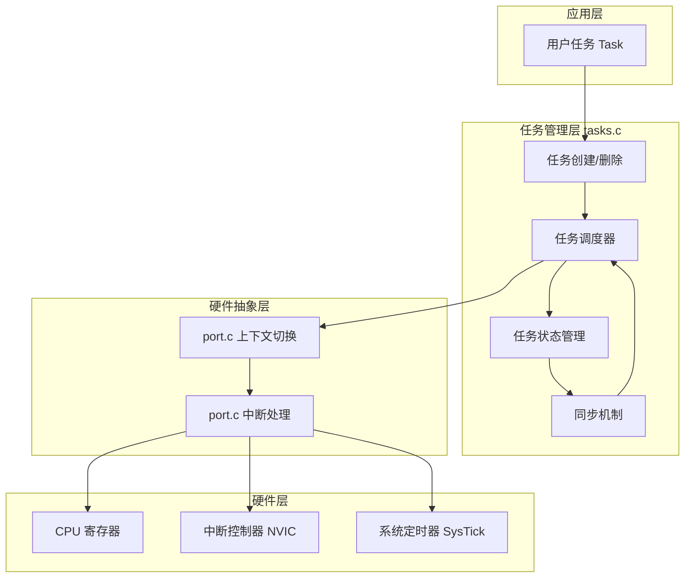
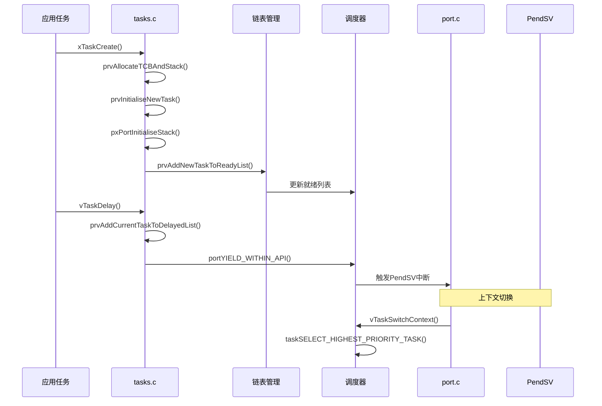
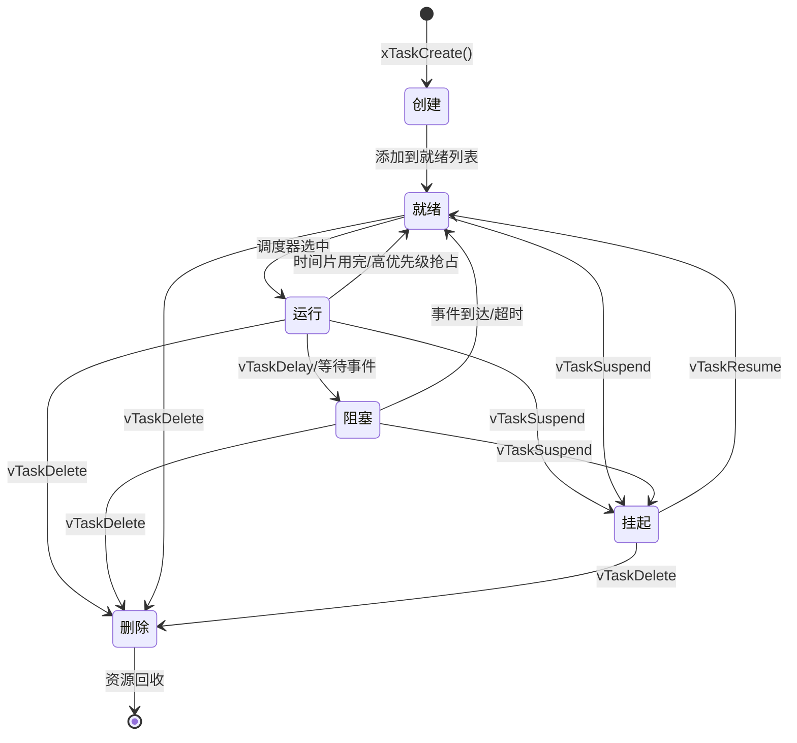
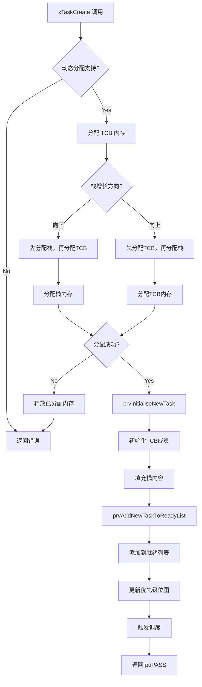
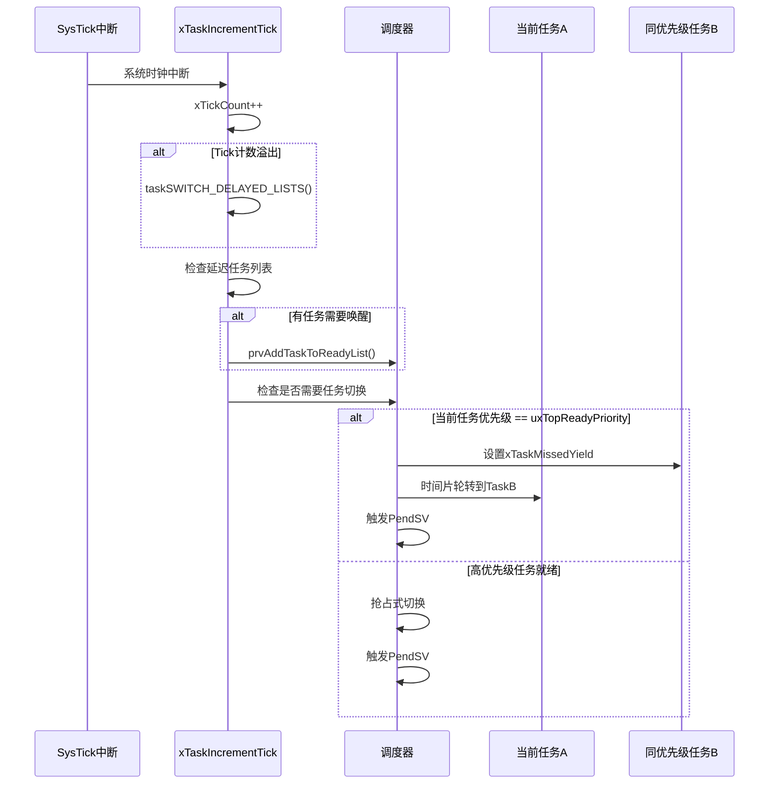
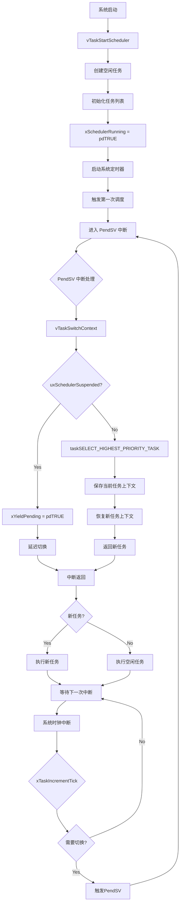
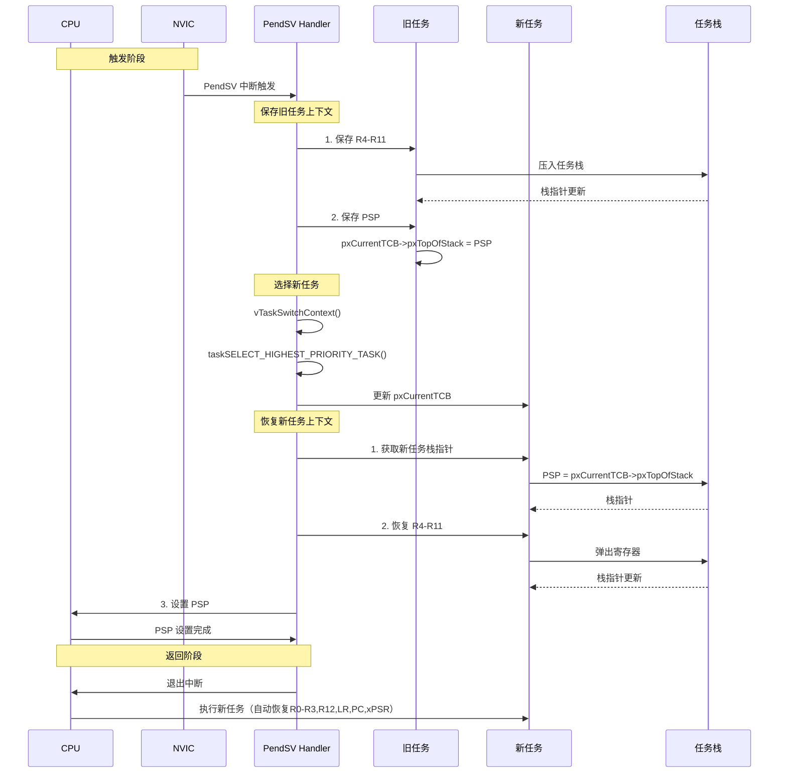
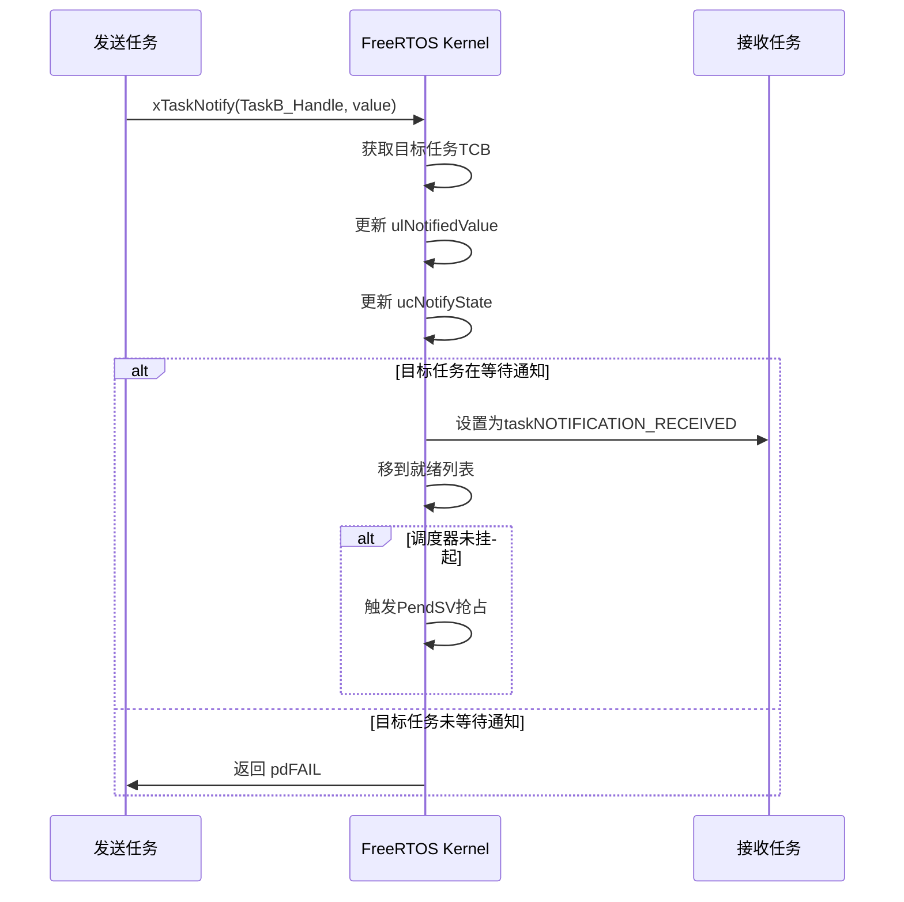
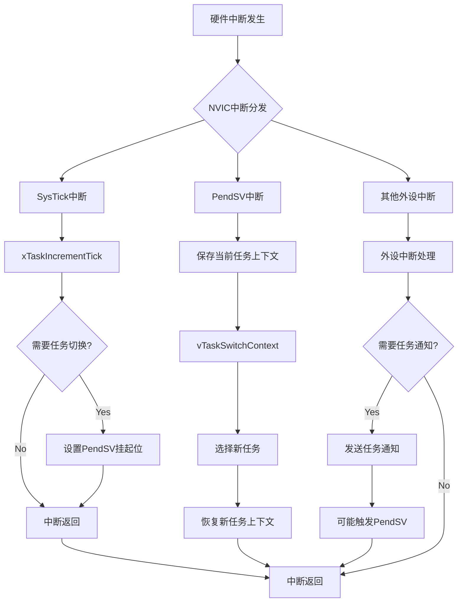

# FreeRTOS tasks.c 文件深度分析

## 文档信息

| 项目 | 内容 |
|------|------|
| 文件名 | tasks.c |
| 所属组件 | FreeRTOS Kernel |
| 版本 | V10.3.1 |
| 功能描述 | 任务管理、调度器、上下文切换核心实现 |
| 分析日期 | 2026-02-23 |

---

## 1. 概述

[`tasks.c`](Middlewares/Third_Party/FreeRTOS/Source/tasks.c) 是 FreeRTOS 实时操作系统的**核心内核文件**，实现了任务管理、调度器、上下文切换等关键功能。它是整个操作系统的"大脑"，负责协调所有任务的执行。

### 1.1 核心功能清单

- ✅ 任务创建与删除
- ✅ 任务状态管理（就绪/运行/阻塞/挂起/删除）
- ✅ 优先级调度算法
- ✅ 时间片轮转调度
- ✅ 上下文切换机制
- ✅ 任务同步与通信（通知、延迟、挂起）
- ✅ 栈溢出检测
- ✅ 性能统计分析

---

## 2. 架构设计

### 2.1 系统架构图



### 2.2 模块交互关系



---

## 3. 核心数据结构

### 3.1 任务控制块（TCB）

```c
typedef struct tskTaskControlBlock {
    volatile StackType_t *pxTopOfStack;     // 栈顶指针（必须是第一个成员）
    
    #if ( portUSING_MPU_WRAPPERS == 1 )
        xMPU_SETTINGS xMPUSettings;        // MPU设置
    #endif
    
    ListItem_t xStateListItem;              // 状态列表项
    ListItem_t xEventListItem;              // 事件列表项
    UBaseType_t uxPriority;                 // 任务优先级
    StackType_t *pxStack;                   // 栈起始地址
    char pcTaskName[ configMAX_TASK_NAME_LEN ]; // 任务名称
    
    #if ( portSTACK_GROWTH > 0 ) || ( configRECORD_STACK_HIGH_ADDRESS == 1 )
        StackType_t *pxEndOfStack;          // 栈底指针
    #endif
    
    #if ( configUSE_MUTEXES == 1 )
        UBaseType_t uxBasePriority;         // 基础优先级（用于优先级继承）
        UBaseType_t uxMutexesHeld;          // 持有的互斥量数量
    #endif
    
    #if ( configUSE_TASK_NOTIFICATIONS == 1 )
        volatile uint32_t ulNotifiedValue;   // 通知值
        volatile uint8_t ucNotifyState;     // 通知状态
    #endif
    
    #if ( configGENERATE_RUN_TIME_STATS == 1 )
        uint32_t ulRunTimeCounter;          // 运行时间统计
    #endif
} tskTCB;
```

### 3.2 TCB 内存布局图

```
┌─────────────────────────────────────────────────────────────┐
│                    TCB 内存布局                              │
├─────────────────────────────────────────────────────────────┤
│  pxTopOfStack  ──────►  ┌─────────────────────────────┐   │
│                         │     任务栈 (Stack)           │   │
│  pxStack  ──────────►   │     ↓ 向下生长              │   │
│                         │     │                       │   │
│                         │     │ (高地址)              │   │
│                         ├─────────────────────────────┤   │
│                         │     TCB 结构体              │   │
│  pxEndOfStack ──────►  │  - pxTopOfStack             │   │
│                         │  - xStateListItem           │   │
│                         │  - xEventListItem           │   │
│                         │  - uxPriority               │   │
│                         │  - pcTaskName               │   │
│                         │  - ulNotifiedValue          │   │
│                         │  - ...                      │   │
│                         └─────────────────────────────┘   │
│                         (低地址)                           │
└─────────────────────────────────────────────────────────────┘
```

### 3.3 任务栈帧结构

```c
// 任务首次运行时的栈帧布局（ARM Cortex-M）
// 这是模拟中断返回时的寄存器布局

// 高地址
// ┌─────────────────────────────┐
// │     xPSR                   │  ← pxTopOfStack 初始位置
// ├─────────────────────────────┤
// │     PC (任务入口地址)       │
// ├─────────────────────────────┤
// │     LR                      │
// ├─────────────────────────────┤
// │     R12                     │
// ├─────────────────────────────┤
// │     R3                      │
// ├─────────────────────────────┤
// │     R2                      │
// ├─────────────────────────────┤
// │     R1                      │
// ├─────────────────────────────┤
// │     R0 (pvParameters)       │
// ├─────────────────────────────┤
// │     EXC_RETURN              │
// ├─────────────────────────────┤
// │     R11                     │
// ├─────────────────────────────┤
// │     R10                     │
// ├─────────────────────────────┤
// │     R9                      │
// ├─────────────────────────────┤
// │     R8                      │
// ├─────────────────────────────┤
// │     R7                      │
// ├─────────────────────────────┤
// │     R6                      │
// ├─────────────────────────────┤
// │     R5                      │
// ├─────────────────────────────┤
// │     R4                      │
// └─────────────────────────────┘  ← pxStack (栈底)
// 低地址
```

### 3.4 就绪任务列表

```c
// 每个优先级对应一个就绪列表
static List_t pxReadyTasksLists[ configMAX_PRIORITIES ];

// 优先级位图（优化查找）
PRIVILEGED_DATA static volatile UBaseType_t uxTopReadyPriority;

// 就绪列表结构
// ┌────────────────────────────────────────────┐
// │ pxReadyTasksLists[0] - 空闲任务优先级      │
// ├────────────────────────────────────────────┤
// │ pxReadyTasksLists[1] - 优先级1            │
// ├────────────────────────────────────────────┤
// │ pxReadyTasksLists[2] - 优先级2            │
// ├────────────────────────────────────────────┤
// │ ...                                        │
// ├────────────────────────────────────────────┤
// │ pxReadyTasksLists[MAX-1] - 最高优先级      │
// └────────────────────────────────────────────┘
```

---

## 4. 任务状态管理

### 4.1 任务状态定义

```c
// 任务状态字符表示（用于调试）
#define tskRUNNING_CHAR     ( 'X' )  // 运行中
#define tskBLOCKED_CHAR     ( 'B' )  // 阻塞
#define tskREADY_CHAR       ( 'R' )  // 就绪
#define tskDELETED_CHAR     ( 'D' )  // 已删除
#define tskSUSPENDED_CHAR  ( 'S' )  // 挂起

// 通知状态
#define taskNOT_WAITING_NOTIFICATION   ( ( uint8_t ) 0 )
#define taskWAITING_NOTIFICATION       ( ( uint8_t ) 1 )
#define taskNOTIFICATION_RECEIVED      ( ( uint8_t ) 2 )
```

### 4.2 任务状态转换图



### 4.3 延迟任务管理

```c
// 延迟任务列表（两个列表用于处理Tick溢出）
static List_t xDelayedTaskList1;           // 当前延迟列表
static List_t xDelayedTaskList2;            // 溢出延迟列表
static List_t * volatile pxDelayedTaskList; // 指向当前使用的列表
static List_t * volatile pxOverflowDelayedTaskList;

// 挂起任务列表
static List_t xSuspendedTaskList;

// 待删除任务列表
static List_t xTasksWaitingTermination;

// 待就绪任务列表（调度器挂起时使用）
static List_t xPendingReadyList;
```

---

## 5. 核心功能模块

### 5.1 任务创建流程



#### 5.1.1 任务创建函数详解

```c
BaseType_t xTaskCreate( TaskFunction_t pvTaskCode,
                       const char * const pcName,
                       const uint16_t usStackDepth,
                       void * const pvParameters,
                       UBaseType_t uxPriority,
                       TaskHandle_t * const pxCreatedTask )
{
    TCB_t *pxNewTCB;
    BaseType_t xReturn;
    
    /* 1. 分配 TCB 和栈空间 - 根据栈生长方向选择分配策略 */
    #if( portSTACK_GROWTH > 0 )
    {
        // 栈向上生长：先分配TCB，再分配栈
        pxNewTCB = ( TCB_t * ) pvPortMalloc( sizeof( TCB_t ) );
        if( pxNewTCB != NULL )
        {
            pxNewTCB->pxStack = ( StackType_t * ) pvPortMalloc( usStackDepth * sizeof( StackType_t ) );
            if( pxNewTCB->pxStack == NULL )
            {
                vPortFree( pxNewTCB );
                pxNewTCB = NULL;
            }
        }
    }
    #else
    {
        // 栈向下生长：先分配栈，再分配TCB
        pxStack = pvPortMalloc( usStackDepth * sizeof( StackType_t ) );
        if( pxStack != NULL )
        {
            pxNewTCB = ( TCB_t * ) pvPortMalloc( sizeof( TCB_t ) );
            if( pxNewTCB != NULL )
            {
                pxNewTCB->pxStack = pxStack;
            }
            else
            {
                vPortFree( pxStack );
            }
        }
    }
    #endif
    
    /* 2. 初始化新任务 */
    if( pxNewTCB != NULL )
    {
        pxNewTCB->ucStaticallyAllocated = tskDYNAMICALLY_ALLOCATED_STACK_AND_TCB;
        prvInitialiseNewTask( pxTaskCode, pcName, usStackDepth, 
                            pvParameters, uxPriority, pxCreatedTask, 
                            pxNewTCB, NULL );
        
        /* 3. 添加到就绪列表 */
        prvAddNewTaskToReadyList( pxNewTCB );
        xReturn = pdPASS;
    }
    else
    {
        xReturn = errCOULD_NOT_ALLOCATE_REQUIRED_MEMORY;
    }
    
    return xReturn;
}
```

#### 5.1.2 栈初始化过程

```c
StackType_t *pxPortInitialiseStack( StackType_t *pxTopOfStack,
                                   TaskFunction_t pxCode,
                                   void *pvParameters )
{
    // 模拟中断返回时的栈帧结构
    *pxTopOfStack = portINITIAL_XPSR;        // xPSR: 初始状态寄存器
    pxTopOfStack--;
    *pxTopOfStack = ( StackType_t ) pxCode;  // PC: 任务入口函数地址
    pxTopOfStack--;
    *pxTopOfStack = ( StackType_t ) 0;       // LR: 返回地址
    pxTopOfStack--;
    *pxTopOfStack = ( StackType_t ) 0;       // R12
    pxTopOfStack--;
    *pxTopOfStack = ( StackType_t ) 0;       // R3
    pxTopOfStack--;
    *pxTopOfStack = ( StackType_t ) 0;       // R2
    pxTopOfStack--;
    *pxTopOfStack = ( StackType_t ) 0;       // R1
    pxTopOfStack--;
    *pxTopOfStack = ( StackType_t ) pvParameters; // R0: 任务参数
    pxTopOfStack--;
    
    #if( portSTACK_GROWTH > 0 )
    // 栈向上生长，不需要保存更多寄存器
    #else
    // 栈向下生长，保存剩余寄存器
    *pxTopOfStack = portINITIAL_EXC_RETURN;  // EXC_RETURN
    pxTopOfStack--;
    *pxTopOfStack = ( StackType_t ) 0;       // R11
    // ... 继续保存 R4-R10
    #endif
    
    return pxTopOfStack;
}
```

### 5.2 调度器核心算法

#### 5.2.1 调度策略对比

| 特性 | 抢占式调度 | 协作式调度 |
|------|-----------|-----------|
| **配置项** | `configUSE_PREEMPTION = 1` | `configUSE_PREEMPTION = 0` |
| **任务切换** | 高优先级任务就绪时立即切换 | 当前任务主动调用 `taskYIELD()` |
| **响应时间** | 优（毫秒级） | 差（取决于任务执行时间） |
| **实时性** | 适合硬实时系统 | 适合简单系统 |
| **复杂度** | 较高（需考虑竞态条件） | 较低 |

| 特性 | 时间片轮转 | 优先级队列 |
|------|-----------|-----------|
| **配置项** | `configUSE_TIME_SLICING = 1` | 默认启用 |
| **同优先级** | 轮转执行 | 队列 FIFO |
| **公平性** | 优 | 一般 |
| **适用场景** | 平等任务 | 主从任务 |

#### 5.2.2 任务选择算法

```c
// 通用版本（configUSE_PORT_OPTIMISED_TASK_SELECTION = 0）
#define taskSELECT_HIGHEST_PRIORITY_TASK()\
{\
    UBaseType_t uxTopPriority = uxTopReadyPriority;\
    \
    /* 从最高优先级开始查找就绪任务 */\
    while( listLIST_IS_EMPTY( &pxReadyTasksLists[ uxTopPriority ] ) )\
    {\
        configASSERT( uxTopPriority );\
        --uxTopPriority;\
    }\
    \
    /* 选择该优先级的下一个任务（时间片轮转）*/\
    listGET_OWNER_OF_NEXT_ENTRY( pxCurrentTCB, \
                                &pxReadyTasksLists[ uxTopPriority ] );\
    uxTopReadyPriority = uxTopPriority;\
}

// 优化版本（configUSE_PORT_OPTIMISED_TASK_SELECTION = 1）
// 使用位图快速查找最高优先级
#define taskSELECT_HIGHEST_PRIORITY_TASK()\
{\
    UBaseType_t uxTopPriority;\
    \
    /* 使用硬件位图快速查找 */\
    portGET_HIGHEST_PRIORITY( uxTopPriority, uxTopReadyPriority );\
    \
    /* 从该优先级列表选择下一个任务 */\
    listGET_OWNER_OF_NEXT_ENTRY( pxCurrentTCB, \
                                &pxReadyTasksLists[ uxTopPriority ] );\
}
```

#### 5.2.3 时间片调度流程



#### 5.2.4 调度器工作流程图



### 5.3 上下文切换机制

#### 5.3.1 上下文切换流程



#### 5.3.2 任务切换触发点

```c
// 1. 系统时钟中断中触发
void xPortSysTickHandler( void )
{
    if( xTaskIncrementTick() != pdFALSE )
    {
        portNVIC_INT_CTRL_REG = portNVIC_PENDSVSET_BIT;  // 触发PendSV
    }
}

// 2. 任务主动让出CPU
#define taskYIELD_IF_USING_PREEMPTION() portYIELD_WITHIN_API()

// 3. 任务通知/延迟等API中触发
void vTaskDelay( const TickType_t xTicksToDelay )
{
    // ... 计算唤醒时间
    prvAddCurrentTaskToDelayedList( xTicksToDelay );
    portYIELD_WITHIN_API();  // 触发任务切换
}
```

### 5.4 任务同步与通信

#### 5.4.1 任务通知机制



#### 5.4.2 延迟任务管理

```c
void vTaskDelay( const TickType_t xTicksToDelay )
{
    TickType_t xTimeToWake;
    BaseType_t xAlreadyYielded;
    
    if( xTicksToDelay > 0 )
    {
        /* 进入临界区 */
        vTaskSuspendAll();
        {
            /* 计算唤醒时间 */
            xTimeToWake = xTickCount + xTicksToDelay;
            
            /* 将任务从就绪列表移除 */
            uxListRemove( &( pxCurrentTCB->xStateListItem ) );
            
            /* 添加到延迟列表 */
            prvAddCurrentTaskToDelayedList( xTimeToWake );
        }
        xAlreadyYielded = xTaskResumeAll();
        
        /* 触发任务切换 */
        if( xAlreadyYielded == pdFALSE )
        {
            portYIELD_WITHIN_API();
        }
    }
}
```

---

## 6. 关键算法原理

### 6.1 优先级调度算法

```c
// 查找最高优先级就绪任务
UBaseType_t prvGetHighestPriority( void )
{
    UBaseType_t uxTopPriority;
    
    // 从最高优先级开始向下查找
    for( uxTopPriority = ( UBaseType_t ) configMAX_PRIORITIES - 1;
         uxTopPriority > ( UBaseType_t ) tskIDLE_PRIORITY;
         uxTopPriority-- )
    {
        if( listCURRENT_LIST_LENGTH( &pxReadyTasksLists[ uxTopPriority ] ) > 0 )
        {
            break;
        }
    }
    
    return uxTopPriority;
}
```

### 6.2 时间片轮转实现

```c
// 相同优先级任务轮转调度
#define listGET_OWNER_OF_NEXT_ENTRY( pxTCB, pxList )\
{\
    List_t * const pxConstList = ( pxList );\
    \
    /* 移动到列表中的下一个项 */\
    pxConstList->pxIndex = pxConstList->pxIndex->pxNext;\
    \
    if( pxConstList->pxIndex == ( ListItem_t * ) &pxConstList->xListEnd )\
    {\
        pxConstList->pxIndex = pxConstList->pxIndex->pxNext;\
    }\
    \
    /* 获取任务控制块 */\
    pxTCB = pxConstList->pxIndex->pvOwner;\
}
```

### 6.3 延迟列表管理

```c
// 切换延迟任务列表（处理Tick溢出）
#define taskSWITCH_DELAYED_LISTS()\
{\
    List_t *pxTemp;\
    \
    /* 交换两个列表 */\
    pxTemp = pxDelayedTaskList;\
    pxDelayedTaskList = pxOverflowDelayedTaskList;\
    pxOverflowDelayedTaskList = pxTemp;\
    \
    /* 增加溢出计数 */\
    xNumOfOverflows++;\
    \
    /* 重置下一个任务解除阻塞时间 */\
    prvResetNextTaskUnblockTime();\
}
```

---

## 7. 内存管理策略

### 7.1 栈溢出检测

```c
#if ( configCHECK_FOR_STACK_OVERFLOW > 0 )
    void vApplicationStackOverflowHook( TaskHandle_t xTask, char *pcTaskName )
    {
        // 方法1：检查栈指针是否超出范围
        if( pxCurrentTCB->pxEndOfStack != pxCurrentTCB->pxTopOfStack )
        {
            // 栈溢出处理
            configASSERT( pdFALSE );
        }
        
        // 方法2：检查栈填充标记
        if( ( *((uint8_t*)pxCurrentTCB->pxStack) ) != tskSTACK_FILL_BYTE )
        {
            configASSERT( pdFALSE );
        }
    }
#endif
```

### 7.2 高水位标记

```c
UBaseType_t uxTaskGetStackHighWaterMark( TaskHandle_t xTask )
{
    TCB_t *pxTCB = xTask;
    uint8_t *pucEndOfStack = ( uint8_t * ) pxTCB->pxEndOfStack;
    uint8_t *pucStack = ( uint8_t * ) pxTCB->pxStack;
    
    // 查找栈中第一个非填充字节
    while( *pucStack == tskSTACK_FILL_BYTE )
    {
        pucStack++;
    }
    
    return ( UBaseType_t ) ( pucEndOfStack - pucStack );
}
```

---

## 8. 中断与调度器交互

### 8.1 中断处理流程



### 8.2 调度器挂起机制

```c
// 挂起调度器（禁止任务切换）
void vTaskSuspendScheduler( void )
{
    uxSchedulerSuspended = pdTRUE;
}

// 恢复调度器
BaseType_t xTaskResumeScheduler( void )
{
    uxSchedulerSuspended = pdFALSE;
    
    if( xYieldPending != pdFALSE )
    {
        return pdTRUE;  // 需要触发任务切换
    }
    
    return pdFALSE;
}

// 在调度器挂起期间，中断使用待就绪列表
if( uxSchedulerSuspended != pdFALSE )
{
    vListInsertEnd( &xPendingReadyList, &( pxTCB->xEventListItem ) );
}
```

---

## 9. 系统配置与优化

### 9.1 关键配置参数

```c
// 调度器配置
#define configUSE_PREEMPTION          1       // 抢占式调度
#define configUSE_TIME_SLICING        1       // 时间片轮转
#define configTICK_RATE_HZ           1000     // 系统时钟频率

// 任务配置
#define configMAX_PRIORITIES          5       // 最大优先级数
#define configMINIMAL_STACK_SIZE      128     // 最小栈大小（字）
#define configMAX_TASK_NAME_LEN       16      // 任务名最大长度

// 功能配置
#define configUSE_IDLE_HOOK           1       // 空闲任务钩子
#define configUSE_TICK_HOOK           0       // 时钟节拍钩子
#define configCHECK_FOR_STACK_OVERFLOW 1    // 栈溢出检查方法

// 优化配置
#define configUSE_PORT_OPTIMISED_TASK_SELECTION 1  // 使用位图优化
#define configUSE_TASK_NOTIFICATIONS    1    // 任务通知
```

### 9.2 性能优化策略

```c
// 1. 使用内联函数减少函数调用开销
#define prvResetNextTaskUnblockTime()\
{\
    xNextTaskUnblockTime = portMAX_DELAY;\
}

// 2. 使用宏代替函数调用
#define taskENTER_CRITICAL() vPortEnterCritical()
#define taskEXIT_CRITICAL() vPortExitCritical()

// 3. 架构优化版本
#if ( configUSE_PORT_OPTIMISED_TASK_SELECTION == 1 )
    #define taskRECORD_READY_PRIORITY( uxPriority )\
        portRECORD_READY_PRIORITY( uxPriority, uxTopReadyPriority )
#else
    #define taskRECORD_READY_PRIORITY( uxPriority )\
    {\
        if( ( uxPriority ) > uxTopReadyPriority )\
        {\
            uxTopReadyPriority = ( uxPriority );\
        }\
    }
#endif
```

---

## 10. 调试与错误处理

### 10.1 断言检查

```c
// 丰富的断言检查机制
configASSERT( uxCriticalNesting );      // 临界区嵌套深度
configASSERT( pxCurrentTCB );           // 当前任务控制块
configASSERT( xTaskIncrementTick() );   // 时钟递增
configASSERT( uxTopPriority );          // 优先级有效性
```

### 10.2 跟踪功能

```c
// 任务切换跟踪
#define traceTASK_SWITCHED_IN()\
    if( pxCurrentTCB != NULL )\
    {\
        traceTASK_SWITCHED_IN();\
    }

#define traceTASK_SWITCHED_OUT()\
    if( pxCurrentTCB != NULL )\
    {\
        traceTASK_SWITCHED_OUT();\
    }

// 任务创建跟踪
#define traceTASK_CREATE( pxNewTCB )\
    if( pxNewTCB != NULL )\
    {\
        traceTASK_CREATE( pxNewTCB );\
    }

// 任务删除跟踪
#define traceTASK_DELETE( pxTask )\
    traceTASK_DELETE( pxTask );
```

### 10.3 调试命令

```c
// 获取任务数量
UBaseType_t uxTaskGetNumberOfTasks( void );

// 获取系统状态
UBaseType_t uxTaskGetSystemState( TaskStatus_t *pxTaskStatusArray,
                                   UBaseType_t uxArraySize,
                                   uint32_t *pulTotalRunTime );

// 获取任务信息
char *pcTaskGetTaskName( TaskHandle_t xTaskToQuery );

// 获取任务优先级
UBaseType_t uxTaskPriorityGet( TaskHandle_t xTask );

// 获取栈高水位
UBaseType_t uxTaskGetStackHighWaterMark( TaskHandle_t xTask );
```

---

## 11. 核心数据结构一览表

| 数据结构 | 位置 | 用途 |
|---------|------|------|
| `TCB_t` | tasks.c:333 | 任务控制块 |
| `List_t` | list.h | 双向链表 |
| `ListItem_t` | list.h | 链表节点 |
| `pxReadyTasksLists[]` | tasks.c:343 | 就绪任务列表数组 |
| `xDelayedTaskList1/2` | tasks.c:344-345 | 延迟任务列表 |
| `xSuspendedTaskList` | tasks.c:359 | 挂起任务列表 |
| `xPendingReadyList` | tasks.c:348 | 待就绪任务列表 |
| `pxCurrentTCB` | tasks.c:337 | 当前运行任务 |

---

## 12. 关键函数一览表

| 函数名 | 功能 | 位置 |
|-------|------|------|
| [`xTaskCreate()`](Middlewares/Third_Party/FreeRTOS/Source/tasks.c:733) | 创建新任务 | tasks.c:733 |
| [`vTaskDelete()`](Middlewares/Third_Party/FreeRTOS/Source/tasks.c:1364) | 删除任务 | tasks.c:1364 |
| [`vTaskDelay()`](Middlewares/Third_Party/FreeRTOS/Source/tasks.c:1787) | 任务延迟 | tasks.c:1787 |
| [`vTaskSuspend()`](Middlewares/Third_Party/FreeRTOS/Source/tasks.c:1530) | 挂起任务 | tasks.c:1530 |
| [`vTaskResume()`](Middlewares/Third_Party/FreeRTOS/Source/tasks.c:1608) | 恢复任务 | tasks.c:1608 |
| [`vTaskSwitchContext()`](Middlewares/Third_Party/FreeRTOS/Source/tasks.c:1175) | 任务切换 | tasks.c:1175 |
| [`xTaskIncrementTick()`](Middlewares/Third_Party/FreeRTOS/Source/tasks.c:1029) | 时钟节拍 | tasks.c:1029 |
| [`xTaskNotify()`](Middlewares/Third_Party/FreeRTOS/Source/tasks.c:2096) | 任务通知 | tasks.c:2096 |

---

## 13. 总结

[`tasks.c`](Middlewares/Third_Party/FreeRTOS/Source/tasks.c) 是 FreeRTOS 的**核心引擎**，它实现了：

1. **完整的任务生命周期管理**：创建、调度、阻塞、删除
2. **高效的调度算法**：优先级抢占 + 时间片轮转
3. **可靠的同步机制**：任务通知、延迟、挂起
4. **强大的调试支持**：栈溢出检测、性能分析
5. **优秀的可移植性**：通过清晰的接口与硬件层分离

理解 `tasks.c` 的工作原理对于深入掌握实时操作系统和进行系统级优化至关重要。

---

## 参考资料

- [FreeRTOS 官方文档](http://www.FreeRTOS.org)
- [FreeRTOS 源码](Middlewares/Third_Party/FreeRTOS/Source/tasks.c)
- [ARM Cortex-M 架构文档](https://developer.arm.com/documentation)
