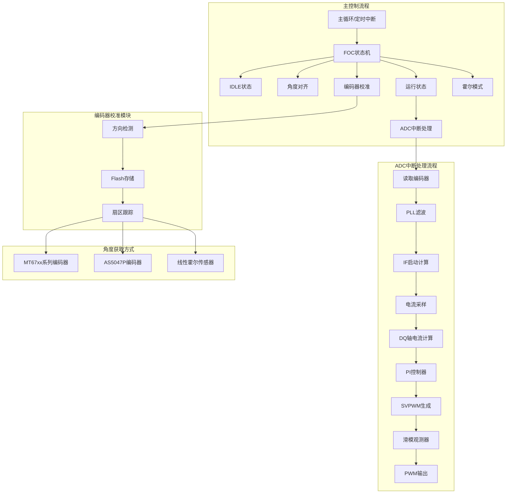
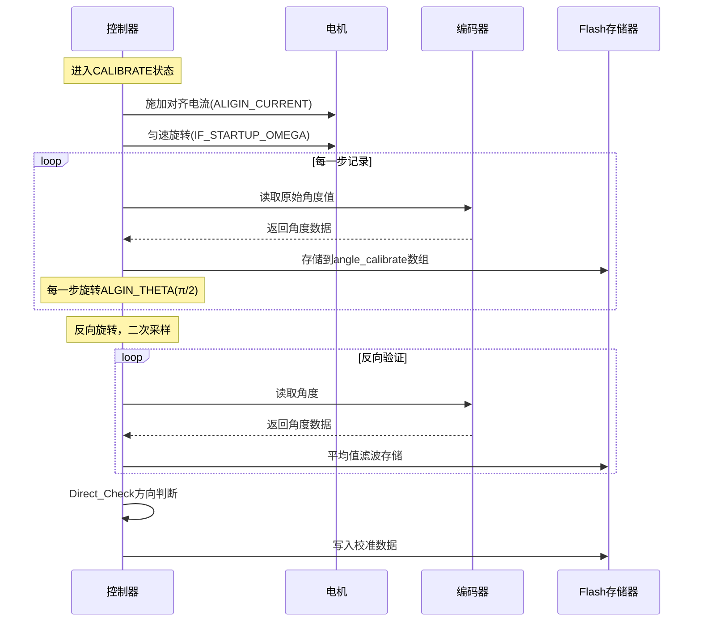
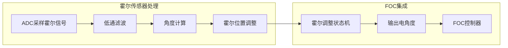

# FOC电机驱动系统流程图与讲义

## 一、整体系统架构图



## 二、编码器校准流程详解

### 2.1 校准原理


### 2.2 关键函数说明

#### `Direct_Check()` - 方向检测
```c
// 功能：检测电机旋转方向，处理零点跨越
// 输入：校准数据缓冲区，FOC校准结构体
// 输出：电机方向（FORWARD/REVERSE）
```

**处理逻辑：**
1. 计算相邻步之间的角度差值
2. 处理零点跨越（差值大于±2×每步理论值）
3. 通过中间区域的变化趋势判断方向

#### `Sector_tracker()` - 扇区跟踪
```c
// 功能：根据编码器原始值计算电角度
// 输入：编码器原始角度，FOC校准结构体
// 输出：精确的电角度（0-360度）
```

**计算步骤：**
1. 根据方向校正角度值
2. 查找当前所在的机械扇区
3. 线性插值计算精确角度
4. 转换为电角度

### 2.3 数据结构
```c
typedef struct {
    float angle;                    // 当前角度
    int16_t direct;                 // 编码器安装方向
    int16_t sector;                 // 当前扇区
    int16_t bias;                   // 电机零点位置
    int16_t Scope_Buff[Move_Step_NUM]; // 电机误差缓存
    int16_t scope;                  // 电机观测误差
    int16_t encoder_lines;          // 编码器线数
    int16_t motor_move_steps;       // 电机移动步数
} foc_calibrate_t;
```

## 三、线性霍尔传感器角度获取

### 3.1 霍尔传感器集成流程



### 3.2 霍尔传感器接口函数

```c
// 在foccontroller.c中的集成
case FOC_STATE_HALL: // 霍尔模式
    hall_adjust.hall_adjust_task();  // 执行霍尔调整任务
    pHandle->alginIq = hall_adjust.motorTargetCurrent;      // 获取目标电流
    pHandle->algintheta = hall_adjust.motorTargetElectricalAngle; // 获取电角度
    utils_norm_angle_rad(&pHandle->algintheta);  // 角度归一化
    break;
```

### 3.3 霍尔传感器读取函数
```c
// 在focencoder.c中的实现
case MT910x:  // 线性霍尔传感器
    data = hall_adjust.hall_adjust_get_angle();
    break;
```

## 四、角度获取流程对比

| 特性 | 编码器校准方式 | 线性霍尔方式 |
|------|---------------|-------------|
| **精度** | 高（通过校准补偿） | 中等（依赖于传感器精度） |
| **校准需求** | 需要离线校准 | 可能需要在位校准 |
| **抗干扰** | 强（数字信号） | 中等（模拟信号） |
| **成本** | 较高 | 较低 |
| **适用场景** | 高性能伺服 | 低成本应用 |

## 五、核心配置文件

### `focconfig.h` 关键参数
```c
// 电机基本参数
#define MOTOR_POLES 8                     // 电机极对数
#define Move_Step_NUM (MOTOR_POLES * 4)   // 校准步数 = 极对数 × 4

// 校准参数
#define ALGIN_THETA (0.25f * M_2PI)       // 每步旋转角度（π/2）
#define ALIGIN_CURRENT (0.50f)            // 校准电流
#define ALIGIN_TIME (500)                 // 定位时间(ms)
```

## 六、实际应用建议

### 6.1 编码器校准最佳实践
1. **环境准备**：确保电机在无负载状态下进行校准
2. **多次校准**：建议进行2-3次校准取平均值
3. **温度补偿**：在不同温度下校准，建立补偿表
4. **异常检测**：检查校准数据的一致性，排除异常点

### 6.2 线性霍尔使用注意事项
1. **信号调理**：确保霍尔信号干净，无高频干扰
2. **位置校准**：安装后需要进行零点校准
3. **温度补偿**：霍尔传感器对温度敏感，需考虑温度影响
4. **线性度验证**：验证传感器在180°范围内的线性度

## 七、调试技巧

### 7.1 编码器校准调试
```c
// 调试输出示例
printf("Calibration Step: %d, Angle: %d\n", i, motor_flash_data.angle_calibrate[i]);
printf("Direction: %s\n", (focx.direct == FORWARD) ? "FORWARD" : "REVERSE");
printf("Bias Position: %d\n", focx.bias);
```

### 7.2 霍尔传感器调试
1. 输出原始ADC值验证信号范围
2. 检查角度计算的连续性
3. 验证电角度与机械角度的对应关系

## 八、总结

本FOC驱动系统提供了灵活的编码器校准和角度获取方案：
1. **高精度应用**：推荐使用编码器校准方案，通过精密校准实现高精度控制
2. **低成本应用**：可使用线性霍尔方案，通过软件算法补偿传感器非线性
3. **混合方案**：可根据需要动态切换不同角度源（如低速用霍尔，高速用编码器）

系统通过状态机管理不同的工作模式，确保在各种应用场景下的可靠性和灵活性。