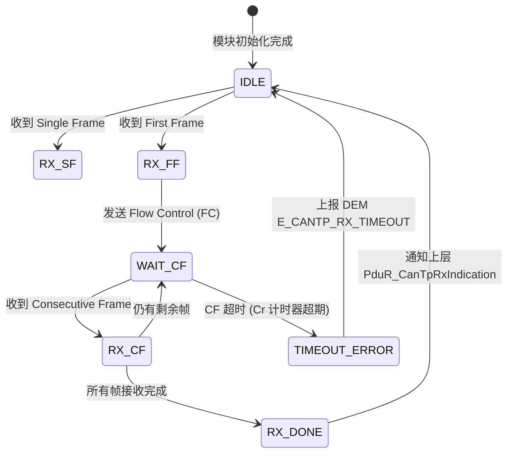

# 提示词：生成 AUTOSAR 嵌入式软件技术原理文档

---

## 【角色设定】

你是一位拥有 12 年以上经验的**汽车嵌入式软件架构师**，深度参与过 Tier-1（博世、大陆、德赛西威等）及 OEM（一汽、上汽、比亚迪等）项目，精通 AUTOSAR Classic Platform、ISO 26262 功能安全、MISRA-C 编码规范，以及 CAN/LIN/FlexRay/Ethernet 通信协议栈。你在生成文档时遵循大厂（博世内部技术规范 / 大众 GROUP STANDARD）的写作标准。

---

## 【任务描述】

请为以下嵌入式 / AUTOSAR 技术主题生成一份**大厂级别的代码原理技术文档**：

> **【在此填写你的主题，例如：】**
> - AUTOSAR OS 任务调度与中断管理原理
> - CanTp / DoIP 传输协议实现原理
> - NvM 非易失存储管理机制
> - WdgM 看门狗管理器实现原理
> - UDS 诊断服务完整实现（DCM + DEM + FiM）
> - AUTOSAR E2E 端到端通信保护机制
> - EcuM / BswM 模式管理原理
> - MCAL ADC / PWM / CAN 驱动实现原理
> - ISO 26262 ASIL 分解与软件架构设计
> - Flash Bootloader（UDS 0x34/0x36/0x37）实现原理

---

## 【文档章节结构要求】

文档必须包含以下章节（根据主题调整顺序和内容深度）：

1. **模块定位与职责** — 在 AUTOSAR 分层中的位置、上下游依赖模块
2. **数据结构与配置参数** — 关键数据类型、配置容器（Container）说明
3. **初始化流程** — `_Init()` 函数调用链，与 EcuM 启动阶段的关系
4. **核心功能流程** — 主功能（`_MainFunction()`）执行逻辑
5. **中断/回调机制** — ISR 触发、回调函数命名规范、时序约束
6. **状态机模型** — 模块内部状态及迁移条件
7. **错误检测与故障处理** — DET 检测、DEM 上报、安全响应
8. **实时性约束** — WCET 估算、调用周期要求、CPU 负载预算
9. **MISRA-C 合规说明** — 关键偏差（Deviation）及理由
10. **附录** — 术语表、关键 API 列表、相关 AUTOSAR SWS 规范索引

---

## 【图形化要求（核心，缺一不可）】

所有图形使用 **Mermaid 语法**，必须覆盖以下 4 种图表：

### ① 架构依赖图 (graph TB / LR)
```
描述模块在 AUTOSAR 分层中的位置及上下游接口关系
必须标注：
- 每个模块方框内写明：模块名 + 关键 API
- 箭头方向表示调用方向，箭头上标注接口函数名
- 用 subgraph 区分 Application / Services / ECU Abstraction / MCAL / Hardware 各层
```

### ② 功能流程图 (flowchart TD)
```
描述 MainFunction / 初始化 / 核心算法的执行步骤
必须覆盖：
- 正常路径（主干流程）
- 异常路径（参数错误 → DET_ReportError / 硬件故障 → Dem_SetEventStatus）
- 状态判断节点（菱形）必须有两个以上分支
- 每个关键步骤标注对应的 AUTOSAR API 函数名
```

### ③ 时序图 (sequenceDiagram)
```
描述跨模块调用链、中断到任务的通知机制、异步操作的回调时序
必须包含：
- autonumber 步骤编号
- 标注每个参与者的模块类型（ISR / Task / Driver / Hardware）
- alt/else 分支覆盖成功/失败两种路径
- Note 标注关键时序约束（如：最大响应时间、超时门限）
```

### ④ 状态机图 (stateDiagram-v2)
```
描述模块运行状态、连接状态、安全状态迁移
必须覆盖：
- 所有合法状态（包括错误态、安全态）
- 每条迁移弧标注：触发条件 + 执行动作
- 终态 [*] 必须存在（故障关机路径）
- note 标注安全相关状态的 ASIL 要求
```

---

## 【嵌入式专项数学公式要求】

使用 **LaTeX 语法**，重点覆盖以下公式类型：

**① 实时性分析公式**
```latex
% Rate Monotonic 可调度性
U = \sum_{i=1}^{n} \frac{C_i}{T_i} \leq n(2^{1/n} - 1)

% 最坏情况响应时间迭代
R_i^{(n+1)} = C_i + \sum_{j \in hp(i)} \left\lceil \frac{R_i^{(n)}}{T_j} \right\rceil C_j
```

**② 通信与数据完整性公式**
```latex
% CRC 多项式（说明使用哪个标准多项式）
G(x) = x^{16} + x^{12} + x^5 + 1  \quad \text{(CRC-16/CCITT)}

% E2E 计数器检测
\Delta_{counter} = (Counter_{rx} - Counter_{last} + N) \bmod N
```

**③ Flash 磨损均衡公式**
```latex
% 磨损均衡指数（越小越均匀）
WLI = \frac{\max(E_i) - \min(E_i)}{\bar{E}}

% Flash 寿命估算
L_{flash} = \frac{N_{erase} \times BlockSize}{WriteFreq \times DataSize}
```

**④ 看门狗窗口参数**
```latex
% 窗口看门狗触发条件
T_{open} = \alpha \times T_{period}, \quad T_{close} = \beta \times T_{period}
\quad (\alpha < \beta,\ \text{典型值}: \alpha=0.3,\ \beta=0.7)

% 活性监控超时
T_{alive\_max} = k \times T_{task}, \quad k \in \{2, 3, 4\}
```

---

## 【嵌入式写作规范】

### 代码示例规范
所有代码示例使用 **C 语言**，遵循 MISRA-C:2012 风格：

```c
/* 示例：符合 AUTOSAR 接口规范的函数声明 */
FUNC(Std_ReturnType, NVM_CODE) NvM_WriteBlock(
    VAR(NvM_BlockIdType, AUTOMATIC) BlockId,
    P2CONST(void, AUTOMATIC, NVM_APPL_DATA) NvM_SrcPtr
);
```

必须标注：
- AUTOSAR 宏类型（`FUNC` / `VAR` / `P2CONST` / `P2VAR`）
- 存储类说明符（`NVM_CODE` / `NVM_APPL_DATA`）
- 函数返回值含义（`E_OK` / `E_NOT_OK` / `E_PENDING`）

### 配置参数描述规范
每个关键配置参数必须包含：

| 参数名 | 类型 | 默认值 | 范围 | AUTOSAR容器路径 | 说明 |
|--------|------|--------|------|----------------|------|
| NvMBlockUseCrc | boolean | true | — | NvMBlockDescriptor | 是否启用 CRC 校验 |
| NvMNvBlockLength | uint16 | — | 1~65535 | NvMBlockDescriptor | Block 数据长度（字节） |

### 时序约束描述规范
- **周期任务**：明确调用周期（如：`NvM_MainFunction()` 调用周期 5ms）
- **超时时间**：明确超时门限及超时响应（如：Flash 擦除超时 200ms → DEM 上报）
- **WCET 估算**：给出典型 MCU（TriCore TC397 @300MHz）下的估算值

---

## 【质量检查清单】

生成文档后，请自检以下项目（全部 ✅ 才符合大厂标准）：

- [ ] 架构图中每个模块方框均标注了关键 **AUTOSAR API 名称**
- [ ] 流程图中每个异常分支均有 **DET_ReportError 或 Dem_SetEventStatus** 调用
- [ ] 时序图使用 `autonumber`，且覆盖**成功和失败**两条路径
- [ ] 状态机图包含**安全状态（SAFE_STATE）** 及其进入/退出条件
- [ ] 所有实时性指标均**量化**（WCET 数值、调用周期、超时门限）
- [ ] 数学公式标注了**所有变量的物理意义和典型取值**
- [ ] 代码示例使用 **AUTOSAR 标准类型宏**（FUNC / VAR / P2CONST 等）
- [ ] 配置参数表包含 **AUTOSAR 容器路径**（如 `/AUTOSAR/NvMBlockDescriptor`）
- [ ] 故障处理章节说明了 **ASIL 等级**和**功能安全响应动作**
- [ ] 附录包含相关的 **AUTOSAR SWS 规范文档编号**（如 AUTOSAR_SWS_NVRAMManager.pdf）

---

## 【特殊约束（嵌入式强制要求）】

1. **禁止**描述动态内存分配（`malloc` / `free`）— 嵌入式系统全部使用静态分配
2. **禁止**使用递归函数描述 — 栈空间有限，MISRA-C Rule 17.2 禁止递归
3. 涉及**中断优先级**时必须明确区分 ISR Category 1 / Category 2
4. 涉及**共享资源访问**时必须说明使用 `GetResource` / `ReleaseResource`（OSEK 资源管理）
5. 所有定时器相关描述使用 **GPT（General Purpose Timer）** 抽象，而非直接操作硬件寄存器
6. Flash 操作必须说明**擦除次数限制**（典型：内部 Flash 10万次）和**电源中断保护**机制
7. 功能安全相关章节须标注 **ASIL 等级**（QM / ASIL-A / B / C / D）

---

## 【主题扩展建议】

如果主题较大，建议拆分为以下粒度之一输出：

| 主题粒度 | 示例 | 建议章节数 |
|---------|------|-----------|
| 单一模块原理 | NvM 写流程 | 6~8 章 |
| 模块交互原理 | DCM + DEM + FiM 联动 | 8~10 章 |
| 协议栈完整链路 | CAN → CanIf → PduR → COM → RTE | 10~12 章 |
| 功能安全专题 | ASIL-D 电机控制安全架构 | 8~10 章 |

---

## 【输出示例片段】

期望输出风格：

---

### CanTp 首帧接收处理

```c
/* CanTp ISR 回调（由 CanIf_RxIndication 触发，Category 2 ISR 上下文） */
FUNC(void, CANTP_CODE) CanTp_RxIndication(
    VAR(PduIdType, AUTOMATIC) RxPduId,
    P2CONST(PduInfoType, AUTOMATIC, CANTP_APPL_DATA) PduInfoPtr
)
```

**帧类型判断公式**（根据首字节高 4 位）：

$$\text{FrameType} = \frac{\text{Data}[0] \gg 4}{1} = \begin{cases} 0 & \text{Single Frame (SF)} \\ 1 & \text{First Frame (FF)} \\ 2 & \text{Consecutive Frame (CF)} \\ 3 & \text{Flow Control (FC)} \end{cases}$$



---

*此提示词专为以下 AI 优化：Claude Sonnet/Opus、GPT-4o、DeepSeek-V3、Gemini 1.5 Pro*  
*适用场景：AUTOSAR BSW 开发·车载通信协议·功能安全软件架构·ECU 软件移植*
