# AUTOSAR 嵌入式软件架构设计原理文档

> **版本**: v3.0.0 | **状态**: 正式发布 | **适用标准**: AUTOSAR Classic Platform R21-11  
> **适用范围**: 车载 ECU 软件开发 · 底层驱动 · 通信栈 · 功能安全  
> **安全等级**: ISO 26262 ASIL-B ~ ASIL-D | **维护团队**: 基础软件平台组

---

## 目录

1. [系统总览](#1-系统总览)
2. [AUTOSAR 分层架构](#2-autosar-分层架构)
3. [OS 任务调度机制](#3-os-任务调度机制)
4. [RTE 通信原理](#4-rte-通信原理)
5. [通信栈协议流程](#5-通信栈协议流程)
6. [诊断服务架构](#6-诊断服务架构)
7. [非易失性存储管理](#7-非易失性存储管理)
8. [看门狗与监控机制](#8-看门狗与监控机制)
9. [ECU 状态机模型](#9-ecu-状态机模型)
10. [实时性分析与调度模型](#10-实时性分析与调度模型)
11. [功能安全机制](#11-功能安全机制)
12. [内存保护与分区](#12-内存保护与分区)
13. [附录：术语表](#13-附录术语表)

---

## 1. 系统总览

AUTOSAR（**AUT**omotive **O**pen **S**ystem **AR**chitecture）Classic Platform 是面向资源受限 MCU 的车载嵌入式软件标准架构。其核心设计目标是：

- **可移植性**：软件组件（SWC）与硬件解耦，通过 RTE 抽象通信
- **可复用性**：BSW 模块标准化，跨 ECU 复用
- **功能安全**：支持 ISO 26262 ASIL-A 至 ASIL-D 混合关键性
- **实时确定性**：基于优先级抢占的静态调度，WCET 可分析

### 1.1 AUTOSAR 软件分层总览

```
┌─────────────────────────────────────────────────────────────────┐
│               应用层 Application Layer                           │
│      SWC_A  │  SWC_B  │  SWC_C  │  SWC_D (软件组件)             │
├─────────────────────────────────────────────────────────────────┤
│               运行时环境 RTE (Runtime Environment)               │
│    Port · Runnable · S/R Interface · C/S Interface              │
├────────────────┬──────────────────┬─────────────────────────────┤
│  服务层        │  ECU 抽象层       │  复杂驱动层                  │
│  Services      │  ECU Abstraction  │  Complex Drivers (CDD)      │
│  OS·WDG·NvM   │  IoHwAb·PduR      │  直接访问硬件                │
├────────────────┴──────────────────┴─────────────────────────────┤
│               微控制器抽象层 MCAL                                 │
│   GPT · ADC · PWM · SPI · CAN · LIN · FlexRay · ETH            │
├─────────────────────────────────────────────────────────────────┤
│               微控制器硬件 MCU / Hardware                         │
│   Cortex-M · TriCore · RH850 · S32K  +  外设寄存器              │
└─────────────────────────────────────────────────────────────────┘
```

---

## 2. AUTOSAR 分层架构

### 2.1 完整模块依赖图

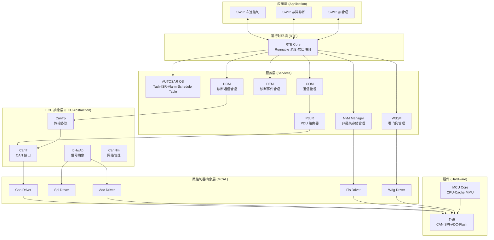

---

## 3. OS 任务调度机制

### 3.1 AUTOSAR OS 任务类型与优先级

AUTOSAR OS 基于 **OSEK/VDX** 标准，采用**静态优先级抢占调度**（Fixed Priority Preemptive Scheduling）。

| 任务类型 | 调度方式 | 典型周期 | ASIL 等级 | 示例 |
|----------|----------|----------|-----------|------|
| ISR Category 1 | 立即响应，不可被 OS 管理 | 事件触发 | ASIL-D | CAN 接收中断 |
| ISR Category 2 | OS 管理，可激活 Task | 事件触发 | ASIL-C/D | 定时器中断 |
| Basic Task | 运行到完成，不允许等待 | 1ms / 5ms / 10ms | ASIL-B/C | 控制算法 |
| Extended Task | 可等待事件，支持 WaitEvent | 20ms / 100ms | QM/ASIL-A | 诊断处理 |

### 3.2 任务调度时序图

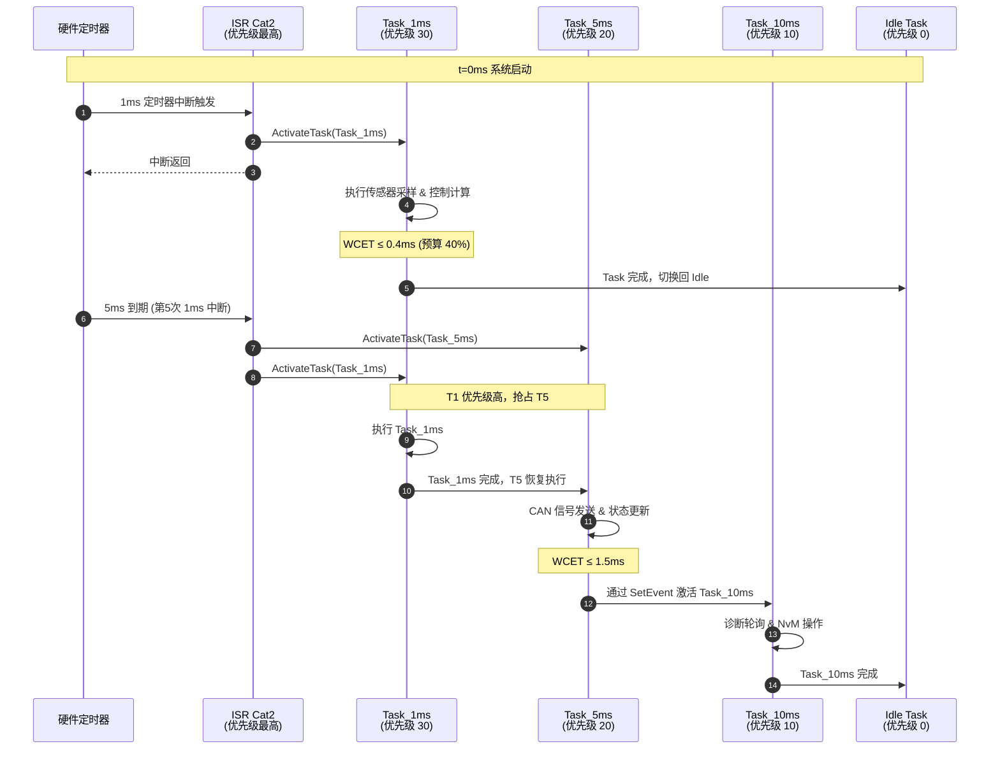

### 3.3 Rate Monotonic 可调度性分析

对于 $n$ 个周期任务，**Rate Monotonic（RM）** 调度的充分条件：

$$U = \sum_{i=1}^{n} \frac{C_i}{T_i} \leq n\left(2^{1/n} - 1\right)$$

其中 $C_i$ 为任务 $i$ 的最坏执行时间（WCET），$T_i$ 为周期。

当 $n \to \infty$ 时，利用率上界趋近于：

$$U_{bound} = \ln 2 \approx 0.693$$

**示例验证**（3个任务）：

| 任务 | 周期 $T_i$ | WCET $C_i$ | 利用率 $C_i/T_i$ |
|------|-----------|-----------|----------------|
| Task_1ms | 1 ms | 0.35 ms | 0.350 |
| Task_5ms | 5 ms | 1.20 ms | 0.240 |
| Task_10ms | 10 ms | 1.50 ms | 0.150 |
| **合计** | — | — | **0.740** |

$$U_{bound}(3) = 3 \times (2^{1/3} - 1) \approx 3 \times 0.26 = 0.779$$

$$0.740 < 0.779 \Rightarrow \text{可调度性验证通过 ✅}$$

---

## 4. RTE 通信原理

### 4.1 SWC 间通信模式

AUTOSAR RTE 提供两种端口接口：

**① Sender/Receiver (S/R) 接口** — 数据流通信，适合周期信号

**② Client/Server (C/S) 接口** — 服务调用通信，适合触发式操作

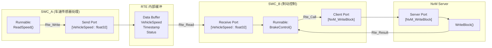

### 4.2 RTE 信号更新时序

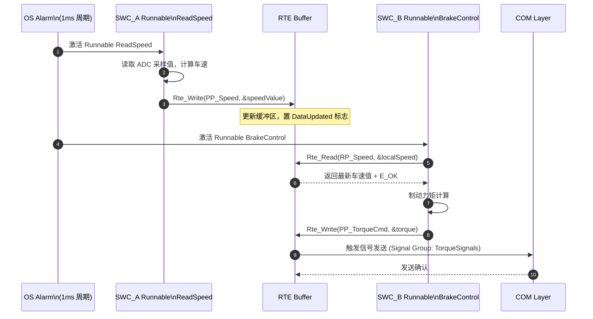

---

## 5. 通信栈协议流程

### 5.1 CAN 发送完整链路

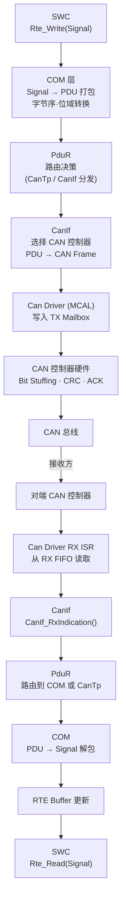

### 5.2 CanTp 分段传输（诊断报文 > 8 字节）

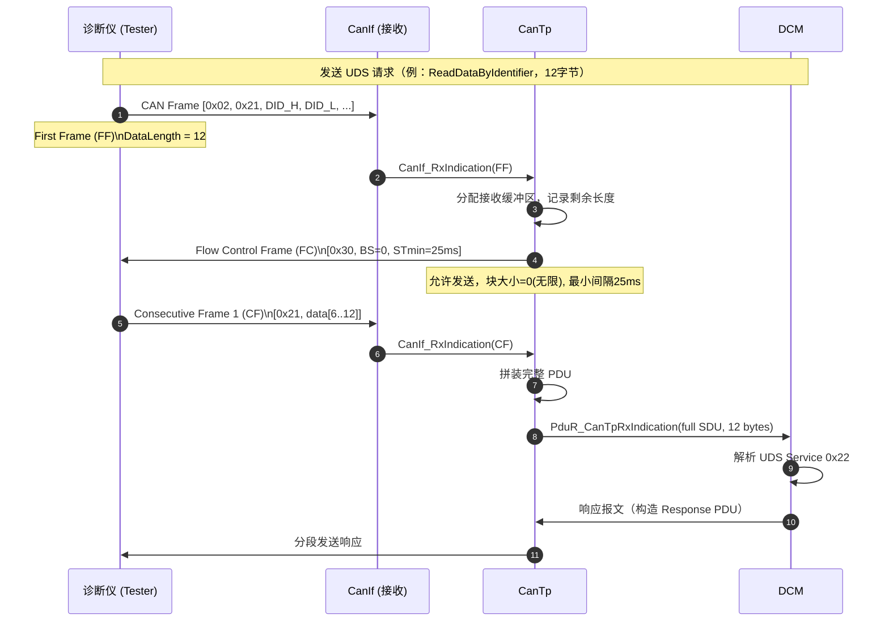

---

## 6. 诊断服务架构

### 6.1 UDS 诊断请求处理流程

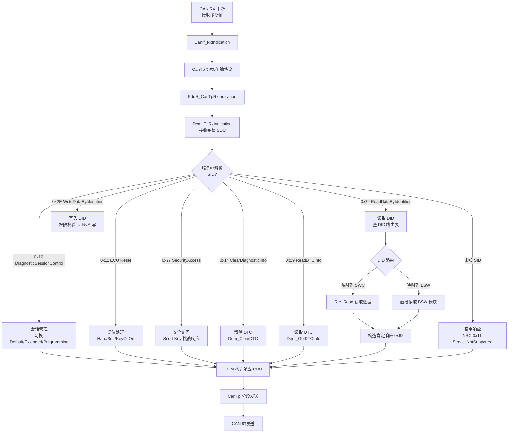

### 6.2 Seed-Key 安全访问时序

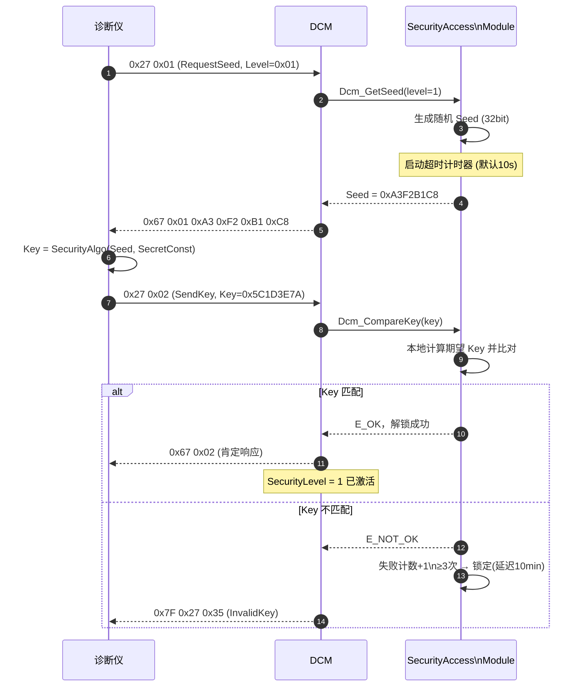

---

## 7. 非易失性存储管理

### 7.1 NvM 模块分层架构

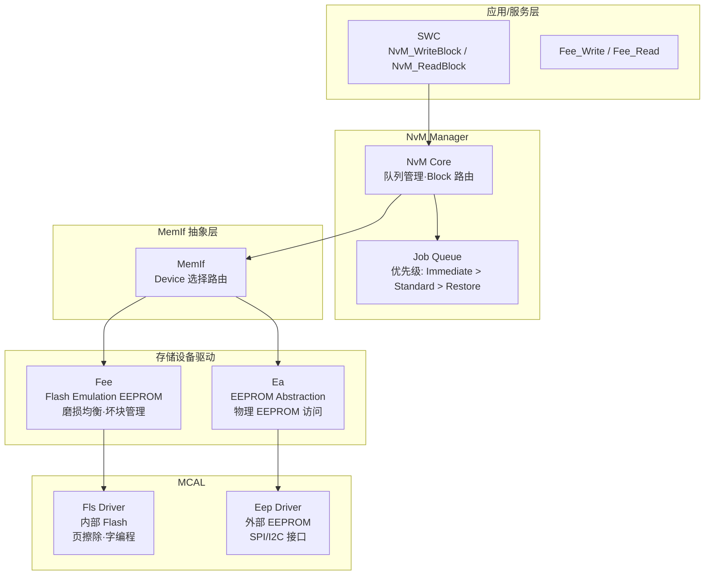

### 7.2 NvM Block 写入时序

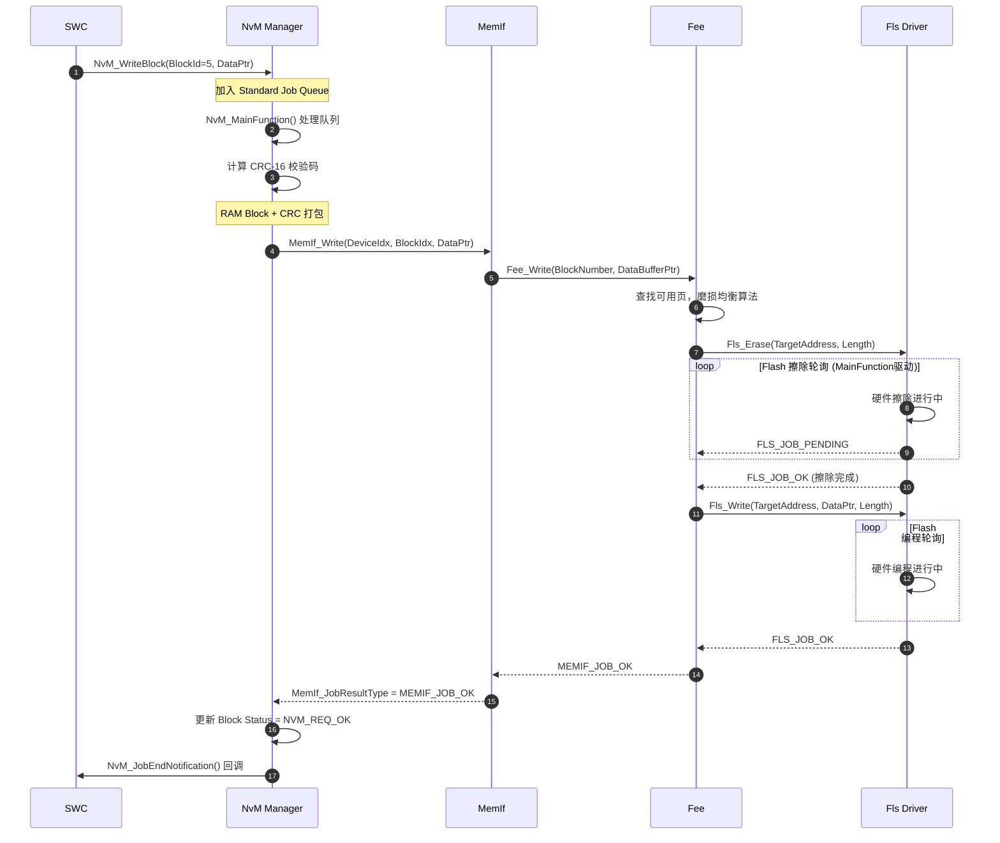

---

## 8. 看门狗与监控机制

### 8.1 WdgM 监控架构

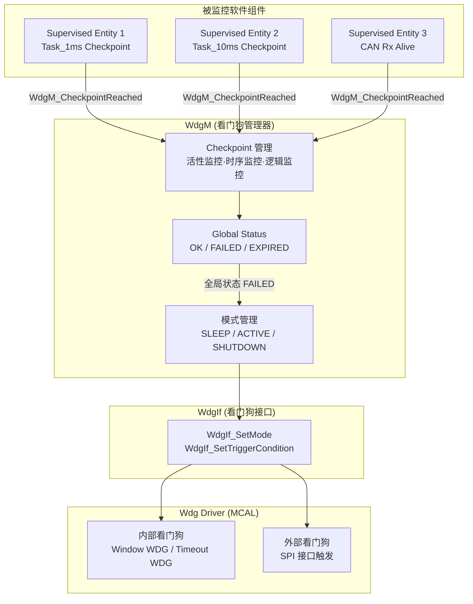

### 8.2 看门狗状态机（窗口看门狗）

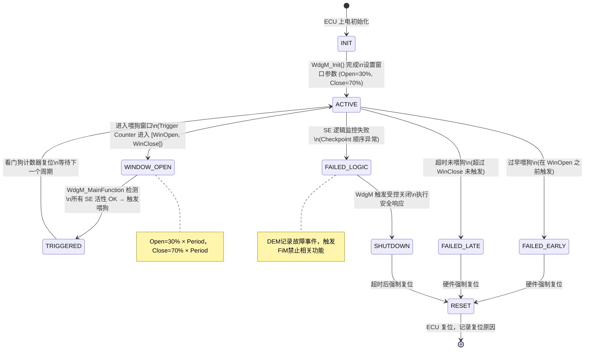

---

## 9. ECU 状态机模型

### 9.1 EcuM 生命周期状态机

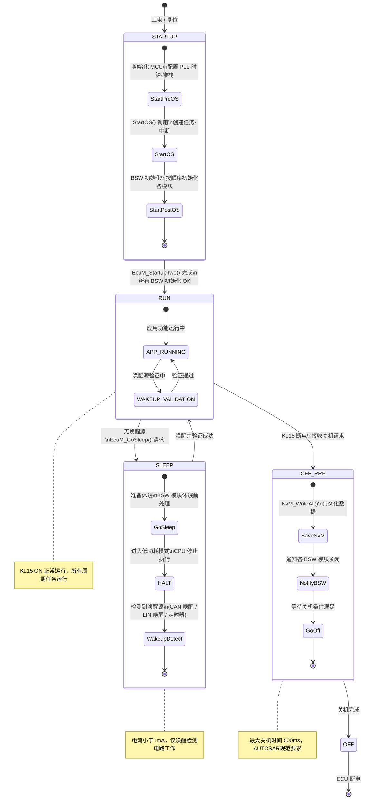

### 9.2 ComM 通信管理器状态机

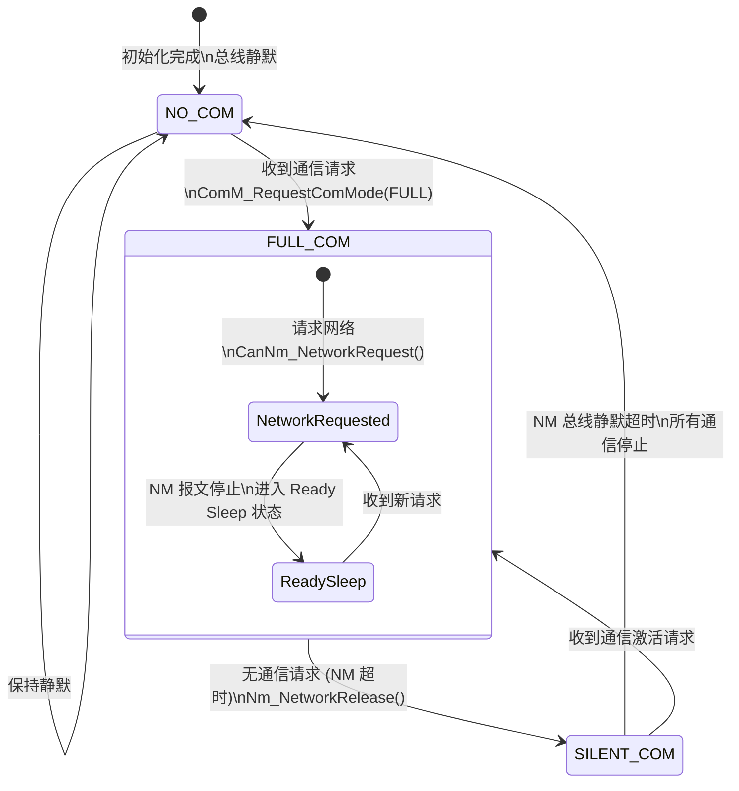

---

## 10. 实时性分析与调度模型

### 10.1 最坏情况响应时间 (WCRT) 分析

对于优先级为 $p$ 的任务 $i$，其最坏情况响应时间 $R_i$ 由以下迭代方程求解：

$$R_i^{(0)} = C_i$$

$$R_i^{(n+1)} = C_i + \sum_{j \in hp(i)} \left\lceil \frac{R_i^{(n)}}{T_j} \right\rceil C_j$$

迭代直至 $R_i^{(n+1)} = R_i^{(n)}$，若 $R_i \leq D_i$（截止期限），则任务可调度。

**示例计算**（Task_5ms，优先级中等，被 Task_1ms 抢占）：

$$R_{5ms}^{(0)} = 1.2\text{ms}$$

$$R_{5ms}^{(1)} = 1.2 + \left\lceil \frac{1.2}{1} \right\rceil \times 0.35 = 1.2 + 2 \times 0.35 = 1.90\text{ms}$$

$$R_{5ms}^{(2)} = 1.2 + \left\lceil \frac{1.9}{1} \right\rceil \times 0.35 = 1.2 + 2 \times 0.35 = 1.90\text{ms}$$

$$R_{5ms} = 1.90\text{ms} \leq D_{5ms} = 5\text{ms} \Rightarrow \text{满足截止期限 ✅}$$

### 10.2 中断延迟模型

任务从触发到开始执行的最大延迟（**调度延迟**）：

$$\Delta_{sched} = T_{ISR} + T_{context\_switch} + \sum_{j \in running} C_j^{remaining}$$

其中：
- $T_{ISR}$：中断响应时间（CPU 流水线刷新 + 向量跳转），典型值 $\approx 50\text{ns}$（TriCore @200MHz）
- $T_{context\_switch}$：OS 上下文切换开销，典型值 $\approx 1\mu s$
- $C_j^{remaining}$：当前运行任务的剩余不可抢占段长度

### 10.3 CPU 负载计算

$$\text{CPU Load} = \frac{\sum_{i=1}^{n} \frac{C_i}{T_i} + \sum_{k=1}^{m} f_k \cdot C_k^{ISR}}{1} \times 100\%$$

其中 $f_k$ 为 ISR $k$ 的触发频率，$C_k^{ISR}$ 为 ISR 执行时间。

**CPU 负载预算分配**（建议）：

| 类别 | 预算占比 | 说明 |
|------|---------|------|
| 周期任务（控制算法） | ≤ 40% | 核心控制功能 |
| 通信栈（CAN/LIN） | ≤ 20% | ISR + 主函数 |
| 诊断与 NvM | ≤ 10% | 低优先级后台任务 |
| OS 开销 | ≤ 5% | 任务切换·调度器 |
| **安全余量** | **≥ 25%** | 应对峰值负载 |

---

## 11. 功能安全机制

### 11.1 ISO 26262 ASIL 分解

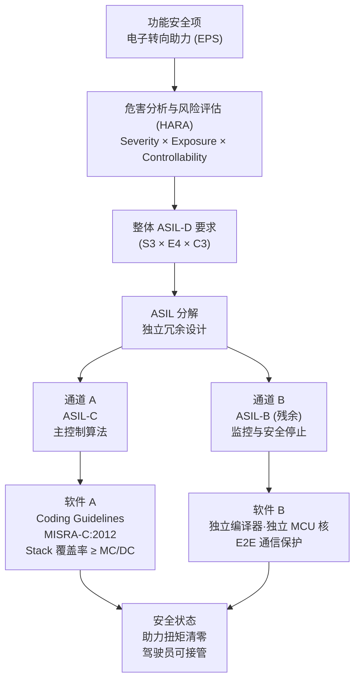

### 11.2 E2E 通信保护（AUTOSAR E2E Profile 2）

端到端保护帧格式：

```
┌──────────┬────────────┬──────────────┬─────────────────────────┐
│ CRC [8b] │ Counter[4b]│ DataID[16b]  │  Payload Data           │
│ CRC-8    │ 0~14 循环  │ 配置固定值   │  实际信号数据            │
└──────────┴────────────┴──────────────┴─────────────────────────┘
```

**CRC-8 计算多项式**（E2E Profile 2）：

$$G(x) = x^8 + x^5 + x^4 + 1 \quad (0x2F)$$

**计数器翻转检测**（接收端）：

$$\Delta_{counter} = (Counter_{received} - Counter_{last} + 15) \bmod 15$$

若 $\Delta_{counter} = 0$：**重复帧**（丢弃）；$\Delta_{counter} > 1$：**帧丢失**（记录错误）；$\Delta_{counter} = 1$：**正常**。

### 11.3 故障注入与安全响应状态机

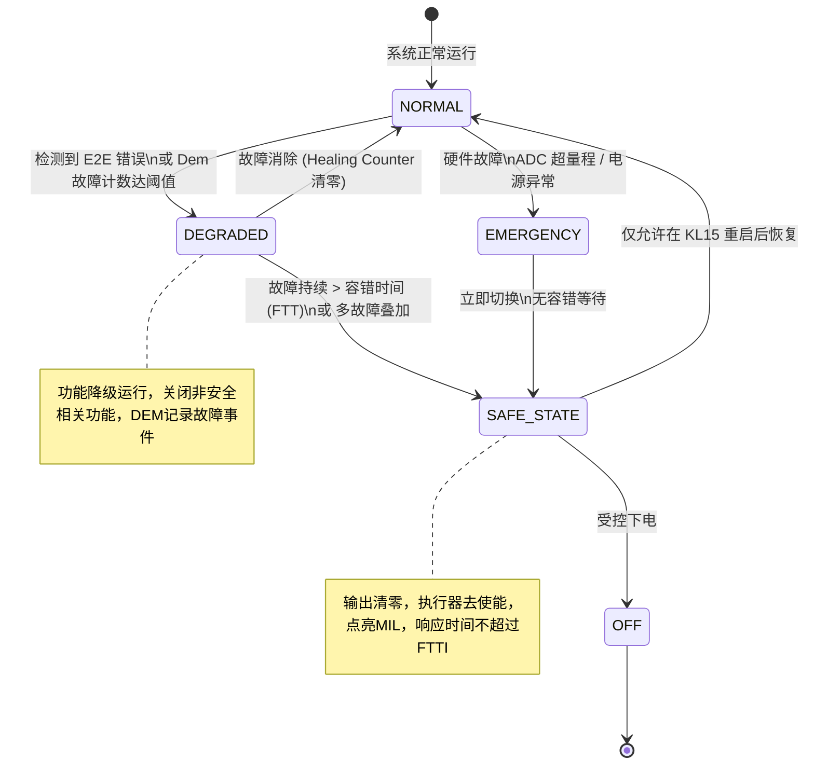

---

## 12. 内存保护与分区

### 12.1 MPU 分区布局（以 Aurix TriCore 为例）

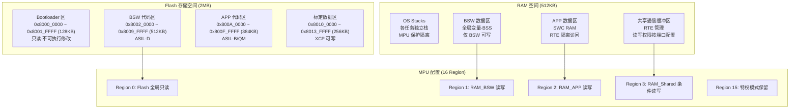

### 12.2 栈溢出检测原理

栈使用水位监控公式（**Stack Pattern 检测**）：

$$\text{Stack\_Usage} = \text{Stack\_Top} - \text{Lowest\_Unpainted\_Address}$$

$$\text{Stack\_Margin} = \text{Stack\_Size} - \text{Stack\_Usage}$$

**安全要求**：$\text{Stack\_Margin} \geq 20\%$ × $\text{Stack\_Size}$

栈尾填充 Magic Pattern `0xDEADBEEF`，若 OS\_Task\_GetStackUsage() 检测 Pattern 被覆写，立即触发 `ProtectionHook(E_OS_STACKFAULT)`。

---

## 13. 附录：术语表

| 术语 | 全称 | 说明 |
|------|------|------|
| AUTOSAR | AUTomotive Open System ARchitecture | 汽车开放系统架构标准 |
| BSW | Basic Software | AUTOSAR 基础软件层，标准化平台组件 |
| RTE | Runtime Environment | 运行时环境，SWC 间及 SWC 与 BSW 间通信中间件 |
| SWC | Software Component | 应用软件组件，通过 Port/Interface 与 RTE 交互 |
| MCAL | Microcontroller Abstraction Layer | 微控制器抽象层，直接操作硬件寄存器 |
| OS | AUTOSAR OS (OSEK-based) | 基于 OSEK/VDX 的静态配置实时操作系统 |
| DCM | Diagnostic Communication Manager | 诊断通信管理器，处理 UDS / OBD 服务 |
| DEM | Diagnostic Event Manager | 诊断事件管理器，管理故障码 (DTC) 生命周期 |
| NvM | Non-volatile Memory Manager | 非易失存储管理器，抽象 Flash/EEPROM 访问 |
| WdgM | Watchdog Manager | 看门狗管理器，监控软件活性与逻辑时序 |
| PduR | PDU Router | PDU 路由器，在通信栈各层间路由数据单元 |
| CanIf | CAN Interface | CAN 接口层，抽象多个 CAN 控制器 |
| CanTp | CAN Transport Protocol | CAN 传输协议，实现 ISO 15765-2 分段/重组 |
| CanNm | CAN Network Management | CAN 网络管理，基于 AUTOSAR NM 规范 |
| Fee | Flash EEPROM Emulation | 用 Flash 模拟 EEPROM，提供磨损均衡 |
| ASIL | Automotive Safety Integrity Level | 汽车安全完整性等级，A~D，D 为最高 |
| HARA | Hazard Analysis and Risk Assessment | 危害分析与风险评估，ISO 26262 安全过程 |
| WCET | Worst-Case Execution Time | 最坏情况执行时间，实时性分析关键指标 |
| WCRT | Worst-Case Response Time | 最坏情况响应时间，包含抢占和阻塞延迟 |
| MPU | Memory Protection Unit | 内存保护单元，实现软件分区隔离 |
| E2E | End-to-End Protection | 端到端通信保护，防止传输错误（CRC+计数器）|
| FTT | Fault Tolerant Time | 故障容忍时间，检测故障到进入安全状态的最大时间 |
| UDS | Unified Diagnostic Services | 统一诊断服务，ISO 14229 标准 |
| MISRA-C | — | 汽车行业 C 语言编码规范，禁止危险语言特性 |

---

> **文档变更记录**
>
> | 版本 | 日期 | 变更内容 | 作者 |
> |------|------|---------|------|
> | v3.0.0 | 2025-11 | 全面重构：AUTOSAR 架构·OS 调度·E2E·MPU 章节 | BSW 平台组 |
> | v2.2.0 | 2025-07 | 新增 EcuM/ComM 状态机·WdgM 窗口看门狗 | 安全组 |
> | v2.0.0 | 2025-03 | 增加 UDS 诊断流程·CanTp 时序·NvM 分层 | 通信组 |
> | v1.0.0 | 2024-09 | 初始版本：基础 AUTOSAR 分层架构描述 | BSW 平台组 |