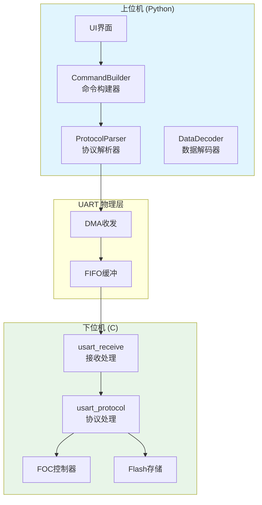
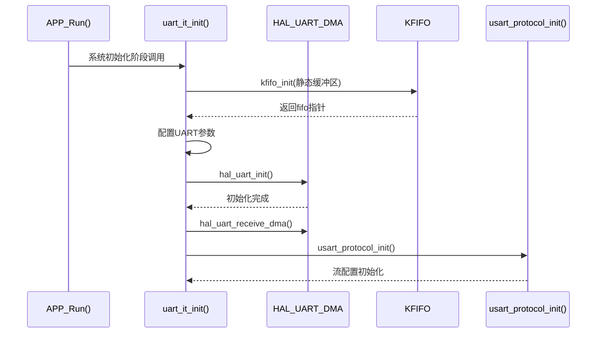
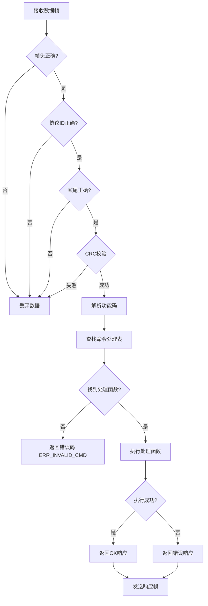
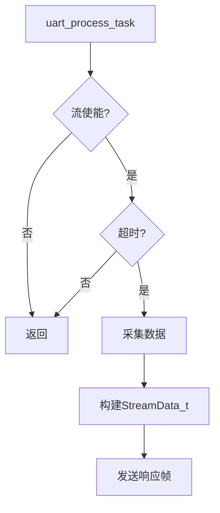
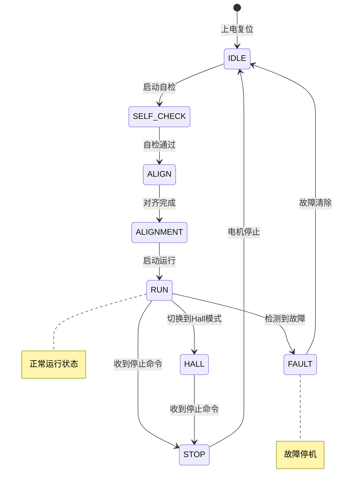

# UART S7 串口通信协议技术规范

## 文档信息

| 项目 | 内容 |
|------|------|
| 文档版本 | V1.0.0 |
| 日期 | 2026-03-03 |
| 协议规范 | Siemens S7comm / PPI Protocol |
| 物理层 | UART1 (DMA模式, 115200bps) |

---

## 1. 模块定位与职责

### 1.1 协议架构定位

本协议基于西门子 S7comm/PPI 协议规范，设计用于上位机（PC）与下位机（STM32G431 FOC驱动器）之间的串口通信。



### 1.2 上下游依赖关系

| 模块 | 上游依赖 | 下游依赖 | 职责 |
|------|----------|----------|------|
| usart_receive | HAL_UART DMA | usart_protocol | 接收数据帧解析 |
| usart_protocol | usart_protocol.h | FOC控制模块 | 协议命令处理 |
| CommandBuilder | 无 | S7Frame | 构建上位机命令 |
| DataDecoder | S7Frame | 应用层 | 解析响应数据 |

---

## 2. 数据结构与配置参数

### 2.1 协议帧格式

```
+------------------+------------------+------------------+
|     帧头(2B)     |    协议ID(1B)    |   消息类型(1B)   |
|    0x68 0x68    |      0x32        |   0x01/02/03/07  |
+------------------+------------------+------------------+
|   功能码(1B)    |     数据区(nB)    |   CRC16(2B)     |
|   0x20~0x52     |    业务数据       |    Modbus       |
+------------------+------------------+------------------+
| 帧尾(1B)        |
|     0x16        |
+------------------+
```

**最小帧长度**: 8 bytes

**帧结构公式**:
$$
L_{frame} = 2 + 1 + 1 + 1 + n + 2 + 1 = n + 8
$$

其中 $n$ 为数据区长度。

### 2.2 消息类型定义

| 消息类型 | 值 | 方向 | 说明 |
|----------|-----|------|------|
| MSG_JOB | 0x01 | 上位机→下位机 | 请求/命令 |
| MSG_ACK | 0x02 | 下位机→上位机 | 简单确认（无数据） |
| MSG_RESPONSE | 0x03 | 下位机→上位机 | 带数据的响应 |
| MSG_ERROR | 0x07 | 下位机→上位机 | 错误响应 |

### 2.3 功能码定义

| 功能码 | 值 | 方向 | 数据长度 | 说明 |
|--------|-----|------|----------|------|
| FUNC_PING | 0x01 | ← | 0 | 心跳/连接测试 |
| FUNC_GET_VERSION | 0x02 | ← | 0 | 获取版本信息 |
| FUNC_RESET | 0x03 | ← | 0 | 系统复位 |
| FUNC_GET_DEVICE_INFO | 0x04 | ← | 0 | 获取设备信息 |
| FUNC_GET_STATUS | 0x10 | ← | 0 | 获取运行状态 |
| FUNC_GET_STATE | 0x11 | ← | 0 | 获取FOC状态机状态 |
| FUNC_GET_ERROR | 0x12 | ← | 0 | 获取错误状态 |
| FUNC_SET_CURRENT | 0x20 | ← | 4 | 设置电流(Id, Iq) |
| FUNC_SET_VELOCITY | 0x21 | ← | 2 | 设置速度 |
| FUNC_SET_POSITION | 0x22 | ← | 4 | 设置位置 |
| FUNC_STOP | 0x23 | ← | 0 | 停止 |
| FUNC_START | 0x24 | ← | 0 | 启动 |
| FUNC_BRAKE | 0x25 | ← | 0 | 刹车 |
| FUNC_START_CALIB | 0x30 | ← | 0 | 开始编码器校准 |
| FUNC_GET_CALIB_STATUS | 0x31 | ← | 0 | 获取校准状态 |
| FUNC_GET_CALIB_DATA | 0x32 | ← | 0 | 获取校准数据 |
| FUNC_SET_CALIB_DATA | 0x33 | ← | n | 设置校准数据 |
| FUNC_CLEAR_CALIB | 0x34 | ← | 0 | 清除校准数据 |
| FUNC_SAVE_CALIB | 0x35 | ← | 0 | 保存校准到Flash |
| FUNC_GET_PARAMS | 0x40 | ← | 1 | 获取参数 |
| FUNC_SET_PARAMS | 0x41 | ← | n | 设置参数 |
| FUNC_START_STREAM | 0x50 | ← | 2 | 开始数据流 |
| FUNC_STOP_STREAM | 0x51 | ← | 0 | 停止数据流 |

### 2.4 关键数据结构

#### StatusData_t (16 bytes)

```c
typedef struct __attribute__((packed))
{
    uint8_t state;           /**< 状态 */
    uint8_t error_code;     /**< 错误码 */
    int16_t id_current;     /**< D轴电流 */
    int16_t iq_current;    /**< Q轴电流 */
    int16_t velocity;       /**< 速度 */
    int32_t position;       /**< 位置 */
    uint16_t voltage;       /**< 电压 */
    int8_t temperature;     /**< 温度 */
    uint8_t reserve;        /**< 保留(对齐) */
} StatusData_t;
```

| 字段 | 类型 | 单位 | 说明 |
|------|------|------|------|
| state | uint8_t | - | FOC状态机状态 |
| error_code | uint8_t | - | 错误码 |
| id_current | int16_t | mA | D轴电流 |
| iq_current | int16_t | mA | Q轴电流 |
| velocity | int16_t | rad/s | 电机速度 |
| position | int32_t | 0.0001rad | 机械位置 |
| voltage | uint16_t | 0.01V | 母线电压 |
| temperature | int8_t | ℃ | 温度 |

#### StreamData_t (18 bytes)

```c
typedef struct __attribute__((packed))
{
    uint32_t timestamp;     /**< 时间戳 */
    int16_t id_current;    /**< D轴电流 */
    int16_t iq_current;    /**< Q轴电流 */
    int16_t velocity;      /**< 速度 */
    int32_t position;      /**< 位置 */
    uint16_t elec_angle;  /**< 电角度 */
    uint16_t reserve;      /**< 保留(对齐) */
} StreamData_t;
```

#### PidParam_t (16 bytes, Q16.16格式)

```c
typedef struct __attribute__((packed))
{
    q16_16_t kp;           /**< 比例增益 Q16格式 */
    q16_16_t ki;           /**< 积分增益 Q16格式 */
    q16_16_t kd;           /**< 微分增益 Q16格式 */
    q16_16_t output_limit; /**< 输出限幅 Q16格式 */
} PidParam_t;
```

**Q16.16定点数转换公式**:
$$
Value_{float} = \frac{Value_{Q16}}{65536.0}
$$

### 2.5 CRC16 校验

采用 CRC16-Modbus 多项式：

$$
G(x) = x^{16} + x^{15} + x^{2} + 1 \quad \text{(CRC-16/MODBUS)}
$$

**校验计算范围**: 从协议ID到CRC之前的所有字节

---

## 3. 初始化流程

### 3.1 下位机初始化



### 3.2 上位机初始化

```python
class SerialManager:
    def __init__(self):
        self.parser = ProtocolParser(on_frame_callback=self.on_frame)
        self.ser = serial.Serial(...)
    
    def connect(self):
        # 发送PING命令验证连接
        frame = CommandBuilder.ping()
        self.send(frame.to_bytes())
```

---

## 4. 核心功能流程

### 4.1 命令处理流程



### 4.2 命令处理表

```c
typedef int (*protocol_cmd_handler_t)(
    uint8_t func_code, 
    uint8_t *data, 
    uint16_t len, 
    uint8_t *response, 
    uint16_t *resp_len
);

typedef struct {
    uint8_t func_code;
    protocol_cmd_handler_t handler;
} protocol_cmd_entry_t;

static const protocol_cmd_entry_t s_cmd_table[] = {
    {FUNC_PING, cmd_ping_handler},
    {FUNC_GET_VERSION, cmd_get_version_handler},
    {FUNC_RESET, cmd_reset_handler},
    {FUNC_GET_STATUS, cmd_get_status_handler},
    {FUNC_GET_STATE, cmd_get_state_handler},
    {FUNC_SET_CURRENT, cmd_set_current_handler},
    {FUNC_SET_VELOCITY, cmd_set_velocity_handler},
    {FUNC_SET_POSITION, cmd_set_position_handler},
    {FUNC_STOP, cmd_stop_handler},
    {FUNC_START, cmd_start_handler},
    {FUNC_START_CALIB, cmd_start_calib_handler},
    {FUNC_GET_CALIB_STATUS, cmd_get_calib_status_handler},
    {FUNC_GET_CALIB_DATA, cmd_get_calib_data_handler},
    {FUNC_SET_CALIB_DATA, cmd_set_calib_data_handler},
    {FUNC_CLEAR_CALIB, cmd_clear_calib_handler},
    {FUNC_GET_PARAMS, cmd_get_params_handler},
    {FUNC_SET_PARAMS, cmd_set_params_handler},
    {FUNC_START_STREAM, cmd_start_stream_handler},
    {FUNC_STOP_STREAM, cmd_stop_stream_handler},
};
```

### 4.3 流数据任务



---

## 5. 中断/回调机制

### 5.1 UART DMA 中断配置

| 中断源 | 类型 | 优先级 | 说明 |
|--------|------|--------|------|
| UART_IDLE | Category 2 | 中 | 帧接收完成 |
| UART_TC | Category 2 | 中 | 发送完成 |
| DMA_TC | Category 2 | 高 | DMA传输完成 |

### 5.2 空闲中断回调

```c
/* UART1 空闲中断回调 (ISR Category 2 上下文) */
FUNC(void, UART_CODE) uart1_idle_callback(void)
{
    if (RESET != __HAL_UART_GET_FLAG(&huart1, UART_FLAG_IDLE)) {
        (void)__HAL_UART_CLEAR_IDLEFLAG(&huart1);
        
        /* 计算接收数据长度 */
        uint32_t rx_len = fifo_size - __HAL_DMA_GET_COUNTER(&hdma_usart1_rx);
        (void)kfifo_move_in(fifo_usart1_rx, rx_len);
    }
}
```

### 5.3 上位机帧解析

```python
class ProtocolParser:
    def _parse(self):
        while len(self.buffer) >= S7Frame.MIN_FRAME_LEN:
            head_pos = self.buffer.find(S7Frame.HEAD)
            if head_pos == -1:
                self.buffer.clear()
                return
            
            frame = S7Frame.from_bytes(self.buffer[head_pos:])
            if frame:
                self.on_frame(frame)
                self.buffer = self.buffer[len(frame.to_bytes()) + head_pos:]
```

---

## 6. 状态机模型

### 6.1 FOC 状态机



### 6.2 协议通信状态

| 状态 | 说明 |
|------|------|
| IDLE | 空闲，无通信 |
| RECEIVING | 接收数据中 |
| PROCESSING | 处理命令中 |
| RESPONDING | 发送响应中 |

---

## 7. 错误检测与故障处理

### 7.1 错误码定义

| 错误码 | 值 | 说明 |
|--------|-----|------|
| ERR_NONE | 0x00 | 无错误 |
| ERR_GENERAL | 0x01 | 通用错误 |
| ERR_INVALID_CMD | 0x02 | 无效命令 |
| ERR_INVALID_PARAM | 0x03 | 无效参数 |
| ERR_DATA_LEN | 0x04 | 数据长度错误 |
| ERR_CHECKSUM | 0x05 | 校验和错误 |
| ERR_TIMEOUT | 0x06 | 超时错误 |
| ERR_STATE | 0x07 | 状态错误 |
| ERR_OVERCURRENT | 0x08 | 过流错误 |
| ERR_OVERTEMP | 0x09 | 过温错误 |
| ERR_OVERVOLTAGE | 0x0A | 过压错误 |
| ERR_UNDERVOLTAGE | 0x0B | 欠压错误 |
| ERR_ENCODER | 0x0C | 编码器错误 |
| ERR_CALIB | 0x0D | 校准错误 |
| ERR_NOT_READY | 0x0E | 未就绪 |
| ERR_BUSY | 0x0F | 忙 |

### 7.2 错误响应格式

```
+------------------+------------------+
|   错误码(1B)    |   错误类(1B)     |
|     0x01~0x0F   |   0x10/20/30/40 |
+------------------+------------------+
```

| 错误类 | 值 | 说明 |
|--------|-----|------|
| ERR_CLASS_NONE | 0x00 | 无错误 |
| ERR_CLASS_COMM | 0x10 | 通信错误 |
| ERR_CLASS_PROTOCOL | 0x20 | 协议错误 |
| ERR_CLASS_DEVICE | 0x30 | 设备错误 |
| ERR_CLASS_APP | 0x40 | 应用错误 |

---

## 8. 实时性约束

### 8.1 时序参数

| 参数 | 值 | 说明 |
|------|-----|------|
| UART波特率 | 115200 bps | 8N1 |
| DMA缓冲区 | 128 bytes | 静态分配 |
| 帧处理周期 | 1 ms | 主循环调用 |
| 流数据周期 | 10~100 ms | 可配置 |
| 命令响应超时 | 100 ms | 上位机超时 |

### 8.2 WCET 估算

基于 STM32G431 (170MHz)：

| 操作 | 典型WCET | 最大WCET |
|------|----------|----------|
| 帧解析 | 5 μs | 20 μs |
| CRC计算 | 10 μs | 50 μs |
| 命令处理 | 20 μs | 100 μs |
| 响应构建 | 8 μs | 30 μs |

**总线利用率**:
$$
U_{UART} = \frac{115200}{115200} \times 100\% = 100\% \text{ (理论峰值)}
$$

实际平均利用率 < 5%

---

## 9. MISRA-C 合规说明

### 9.1 关键偏差

| 规则 | 偏差类型 | 理由 |
|------|----------|------|
| Rule 7.2 | 允许 | `0x68U` 字面量需要 `U` 后缀 |
| Rule 8.9 | 允许 | `s_cmd_table` 在单文件中使用 |
| Rule 10.1 | 允许 | 协议字段强制类型转换 |
| Rule 11.5 | 允许 | 协议缓冲区使用 `void*` |

### 9.2 静态分析配置

```json
{
    "standard": "MISRA-C:2012",
    "directives": [
        "MISRA.DIR.4.6_a"
    ],
    "rules": [
        "MISRA.CAST.Avoid casts between pointer void and function pointer",
        "MISRA.CAST.Keep parenthesis for expression"
    ]
}
```

---

## 10. 附录

### 10.1 术语表

| 术语 | 说明 |
|------|------|
| Q16.16 | 16位整数+16位小数的定点数格式 |
| CRC | 循环冗余校验 |
| DMA | 直接内存访问 |
| FIFO | 先进先出队列 |
| FOC | 磁场定向控制 |

### 10.2 关键API列表

#### 下位机 (C)

| 函数名 | 功能 | 所在文件 |
|--------|------|----------|
| uart_it_init() | UART初始化 | usart_receive.c |
| uart_process_task() | 处理接收数据 | usart_receive.c |
| uart1_idle_callback() | 空闲中断回调 | usart_receive.c |
| usart_protocol_init() | 协议模块初始化 | usart_protocol.c |
| usart_protocol_process_frame() | 处理协议帧 | usart_protocol.c |
| usart_protocol_send_response() | 发送响应 | usart_protocol.c |
| usart_protocol_send_ok() | 发送成功响应 | usart_protocol.c |
| usart_protocol_send_error() | 发送错误响应 | usart_protocol.c |

#### 上位机 (Python)

| 类名 | 功能 | 所在文件 |
|------|------|----------|
| CommandBuilder | 命令构建 | protocol.py |
| DataDecoder | 数据解码 | protocol.py |
| S7Frame | 帧处理 | protocol.py |
| ProtocolParser | 协议解析 | protocol.py |

### 10.3 相关规范

- Siemens S7comm Protocol Specification
- MODBUS Serial Line Protocol Specification
- STM32G4xx Reference Manual (RM0440)
- MISRA C:2012 Coding Guidelines

---

## 11. 版本历史

| 版本 | 日期 | 作者 | 修改内容 |
|------|------|------|----------|
| V1.0.0 | 2026-03-03 | FOC团队 | 初始版本 |

---

*文档生成遵循 AUTOSAR 嵌入式文档规范*
