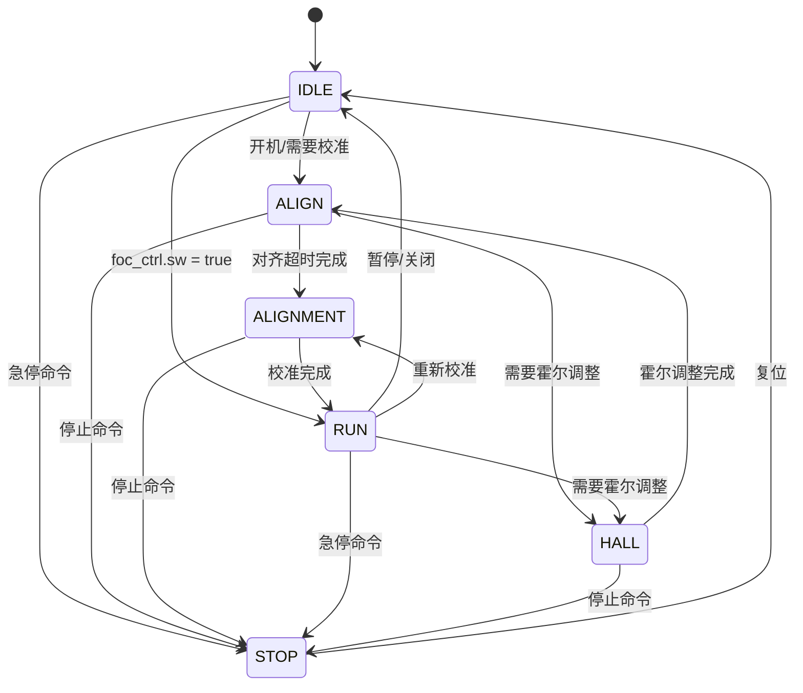
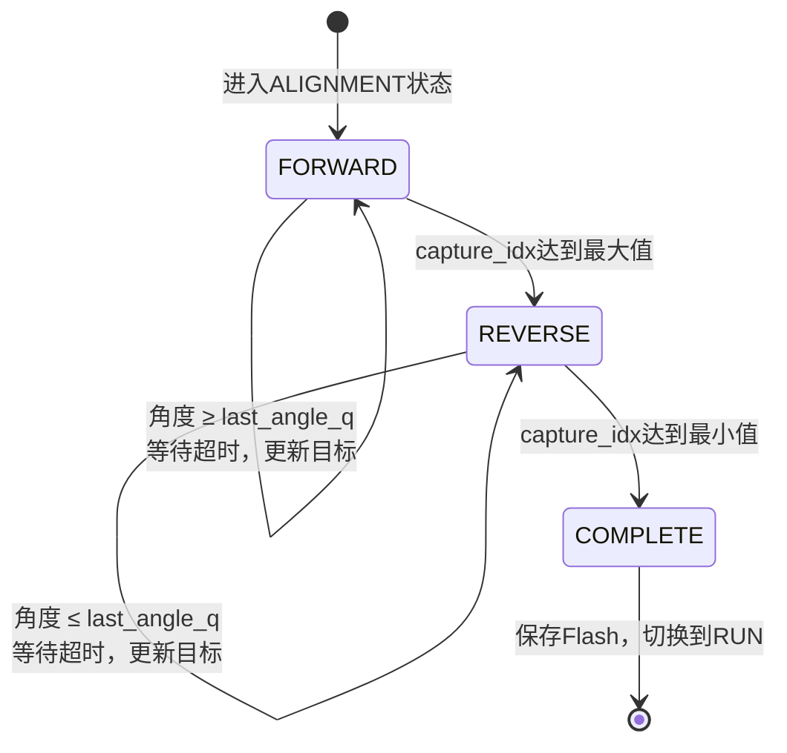
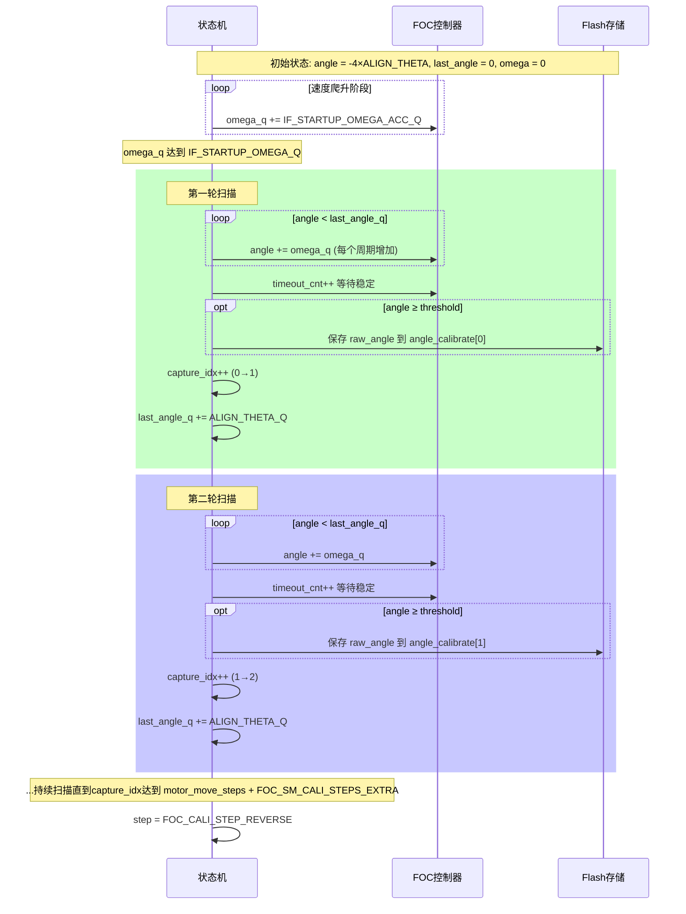
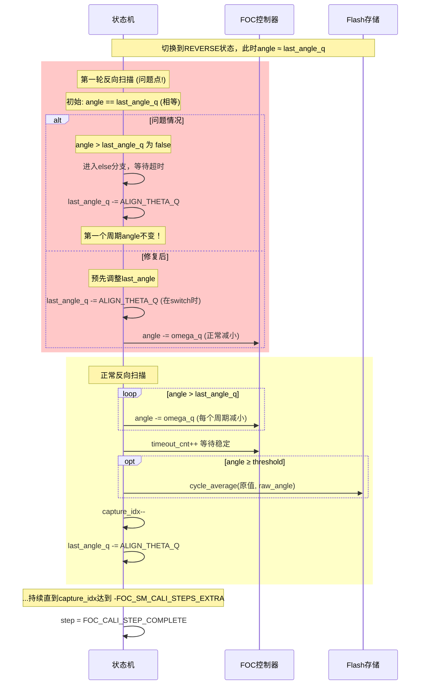
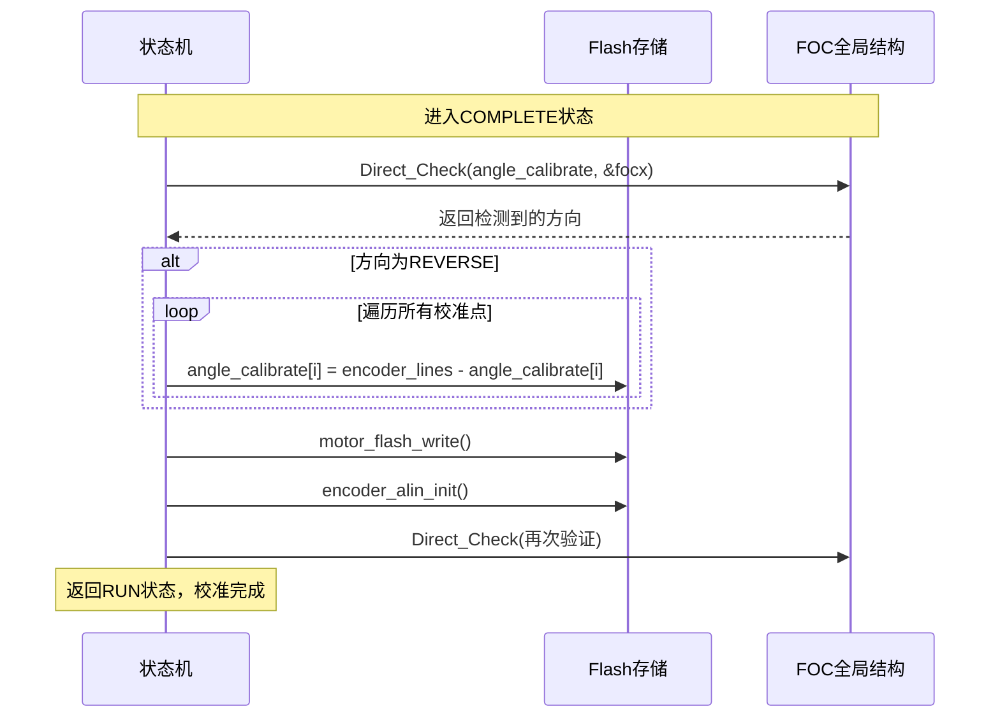

# FOC State Machine 详细文档

## 1. 概述

FOC（Field Oriented Control，磁场定向控制）状态机负责管理电机从初始化到运行的各个阶段，包括预充电对齐、编码器校准、正常运行和霍尔传感器调整。

---

## 2. 状态定义

| 状态 | 枚举值 | 功能描述 |
|------|--------|----------|
| **IDLE** | 0 | 空闲状态，等待启动命令 |
| **ALIGN** | 1 | 预充电对齐状态，固定转子到已知位置 |
| **ALIGNMENT** | 2 | 编码器校准状态，扫描全范围并记录编码器数据 |
| **RUN** | 3 | 正常运行状态，FOC闭环运行 |
| **HALL** | 4 | 霍尔传感器调整状态 |
| **STOP** | 5 | 停止状态，关闭PWM输出 |

---

## 3. 状态转换表

```
┌────────────────┬─────────────────────────────────────────────────────────────────────┐
│ 当前状态       │ 允许的目标状态                                                      │
├────────────────┼─────────────────────────────────────────────────────────────────────┤
│ IDLE           │ ALIGN, RUN, STOP                                                    │
├────────────────┼─────────────────────────────────────────────────────────────────────┤
│ ALIGN          │ ALIGNMENT, HALL, STOP                                               │
├────────────────┼─────────────────────────────────────────────────────────────────────┤
│ ALIGNMENT      │ RUN, STOP                                                           │
├────────────────┼─────────────────────────────────────────────────────────────────────┤
│ RUN            │ HALL, IDLE, STOP, ALIGNMENT                                         │
├────────────────┼─────────────────────────────────────────────────────────────────────┤
│ HALL           │ ALIGN, STOP                                                         │
├────────────────┼─────────────────────────────────────────────────────────────────────┤
│ STOP           │ IDLE                                                                │
└────────────────┴─────────────────────────────────────────────────────────────────────┘
```

---

## 4. 状态转移图



---

## 5. 校准子状态机（ALIGNMENT状态内部）

校准过程分为三个子步骤，用于扫描电机的全部电气角度并记录编码器对应值。

### 5.1 子状态定义

| 子状态 | 功能描述 |
|--------|----------|
| **FORWARD** | 正向扫描：从-π增加到正的最大值，记录编码器数据 |
| **REVERSE** | 反向扫描：从正向结束位置减小到负值，取平均值 |
| **COMPLETE** | 校准完成：写入Flash，切换到RUN状态 |

### 5.2 校准子状态流程图



---

## 6. 校准过程详细时序图

### 6.1 正向校准（FORWARD）时序



### 6.2 反向校准（REVERSE）时序



### 6.3 校准完成时序



---

## 7. 关键变量变化示意图

### 7.1 电气角度变化（理想情况）

```text
电
气
角
度
 │                                    ↗  REVERSE阶段
 │                                ╱
 │                            ╱               (减至负值)
 │                        ╱    ↗
 │                    ╱    ╱
 │                ╱    ╱                   FORWARD阶段
 │            ╱    ╱                    (从负值增至正值)
 │        ╱    ╱
 │    ╱    ╱
 │╱──────────────→ 时间
 -4π   -2π      0      2π      4π      6π

校准步骤:
  [ ALIGNMENT进入 ]       [ FORWARD ]         [ REVERSE ]      [ COMPLETE ]
```

### 7.2 捕获索引变化

```text

     │
     │                              ╭────────────────
  36 ┤                         ╭────╯
     │                    ╭────╯
     │               ╭────╯                   正向扫描
     │          ╭────╯                   (索引递增)
     │     ╭────╯
     │╭────╯
  ───┼──────────────────────────────────────────────
     │
   0 ┤                                          完成
     │
     │
-4   ┤        ╰────╮
     │             ╰────╮
     │                  ╰────╮                反向扫描
     │                       ╰────╮      (索引递减，取平均)
     │                            ╰────╮
     │                                 ╰──────────
     └──────────────────────────────────────────────
     FORWARD              REVERSE            COMPLETE
```

---

## 8. 代码流程详细分析

### 8.1 状态机主循环

```
┌─────────────────────────────────────────────────────────────┐
│                    foc_sm_step() 主循环                       │
└─────────────────────────────────────────────────────────────┘
                            │
                            ▼
┌─────────────────────────────────────────────────────────────┐
│ 1. 检查状态变化 (state_changed)                               │
│    - 调用 handle_state_exit(last_state)                     │
│    - 调用 handle_state_entry(current_state)                 │
│    - 更新 last_state                                         │
└─────────────────────────────────────────────────────────────┘
                            │
                            ▼
┌─────────────────────────────────────────────────────────────┐
│ 2. 执行当前状态处理函数                                      │
│    next_state = g_state_handlers[current_state](ctx)        │
└─────────────────────────────────────────────────────────────┘
                            │
                            ▼
┌─────────────────────────────────────────────────────────────┐
│ 3. 检查状态转换                                               │
│    - 如果 next_state != current_state                       │
│    - 检查 is_valid_transition()                             │
│    - 更新 current_state，设置 state_changed = true           │
└─────────────────────────────────────────────────────────────┘
                            │
                            ▼
┌─────────────────────────────────────────────────────────────┐
│ 4. 更新对齐标志和计算PLL速度                                  │
└─────────────────────────────────────────────────────────────┘
```

### 8.2 ALIGNMENT状态详细流程

```
                    进入 ALIGNMENT 状态
                           │
                           ▼
┌────────────────────────────────────────────────────────┐
│ 初始化:                                                │
│  - capture_idx = 0                                     │
│  - step = FOC_CALI_STEP_FORWARD                        │
│  - omega_q = 0 (加速到 IF_STARTUP_OMEGA_Q)             │
│  - angle_q = -4 × ALIGN_THETA_Q                        │
└────────────────────────────────────────────────────────┘
                           │
                           ▼
┌────────────────────────────────────────────────────────┐
│ 速度爬升阶段                                            │
│ 每个周期: omega_q += IF_STARTUP_OMEGA_ACC_Q             │
│ 直到 omega_q >= IF_STARTUP_OMEGA_Q                     │
└────────────────────────────────────────────────────────┘
                           │
                           ▼
            ┌──────────────┴──────────────┐
            │                             │
            ▼                             ▼
┌───────────────────────┐   ┌───────────────────────────┐
│   FOC_CALI_STEP_      │   │   FOC_CALI_STEP_REVERSE   │
│     FORWARD           │   │                           │
├───────────────────────┤   ├───────────────────────────┤
│ while angle < target: │   │ while angle > target:     │
│   angle += omega_q    │   │   angle -= omega_q        │
│                       │   │                           │
│ 达到target后:         │   │ 达到target后:             │
│ - 等待250个周期稳定   │   │ - 等待250个周期稳定       │
│ - 保存编码器值(+向)   │   │ - 取平均值(-向)           │
│ - capture_idx++       │   │ - capture_idx--           │
│ - target += ALIGN_THETA│   │ - target -= ALIGN_THETA  │
│                       │   │                           │
│ 直到idx达到max:       │   │ 直到idx达到-4:            │
│ 切换到REVERSE ────────┘   │ 切换到COMPLETE            │
└───────────────────────┘   └───────────────────────────┘
                                        │
                                        ▼
                           ┌────────────────────────┐
                           │  FOC_CALI_STEP_COMPLETE │
                           ├────────────────────────┤
                           │ - Direct_Check()        │
                           │ - 必要时反转数据        │
                           │ - motor_flash_write()   │
                           │ - encoder_alin_init() │
                           │ - 返回RUN状态           │
                           └────────────────────────┘
```

---

## 9. 关键常量和宏

| 常量/宏 | 值 | 说明 |
|---------|-----|------|
| `ALIGN_THETA_Q` | π/2 (1.5708 rad) | 每次角度步进量 |
| `ALIGN_CURRENT_Q` | 0.5 | 对齐电流 |
| `IF_STARTUP_IQ_Q` | 0.5 | 启动Q轴电流 |
| `IF_STARTUP_OMEGA_Q` | ~0.26 rad/周期 | 最大扫描速度 |
| `FOC_SM_ELEC_ANGLE_STABLE_TIME` | 250 | 角度稳定等待计数 |
| `FOC_SM_CALI_STEPS_EXTRA` | 4 | 校准额外步数 |
| `motor_move_steps` | 32 (8极×4) | 电机总步数 |

---

## 10. 已知问题和修复建议

### 问题1: REVERSE步骤初始延迟

**问题描述**: 切换到REVERSE步骤时，第一个周期`angle == last_angle_q`，导致条件`angle > last_angle_q`为false，第一个周期angle不变。

**影响**: 可能导致第一个反向校准点数据不准确。

**修复方案** (在switch到REVERSE时预调整):

```c
if (ctx->cali_ctx.capture_idx >= max) {
    ctx->cali_ctx.step = FOC_CALI_STEP_REVERSE;
    // 修复: 预调整last_angle_q，确保角度立即开始减小
    ctx->cali_ctx.last_angle_q = q16_16_sub(ctx->cali_ctx.last_angle_q, ALIGN_THETA_Q);
    return ctx->current_state;
}
```

### 问题2: foc_ctrl_q16.c中的调试代码

**问题描述**: `foc_ctrl_q16.c:110` 有强制增加角度的调试用代码：
```c
foc_ctrl.electrical_angle_q += FLOAT_TO_Q16_16(0.01f);
```

**影响**: 会导致状态机中角度控制失效，角度持续增大。

**修复方案**: 删除或注释掉这行代码。

---

## 11. 调试技巧

1. **打印状态变化**: 状态机已集成DEBUG_INFO宏，每次状态转换会记录日志

2. **监控关键变量**:
   - `electrical_angle_q`: 电气角度（Q16.16格式）
   - `omega_q`: 角速度（Q16.16格式）
   - `capture_idx`: 当前捕获索引
   - `step`: 校准子状态

3. **校准数据验证**: 校准完成后会打印编码器方向，应验证Flash中存储的数据是否正确

---

**文档生成日期**: 2026-02-01  
**版本**: V1.0  
**关联文件**: [foc_sm.c](../Q16_FOC/foc_sm.c), [foc_sm.h](../Q16_FOC/foc_sm.h)
