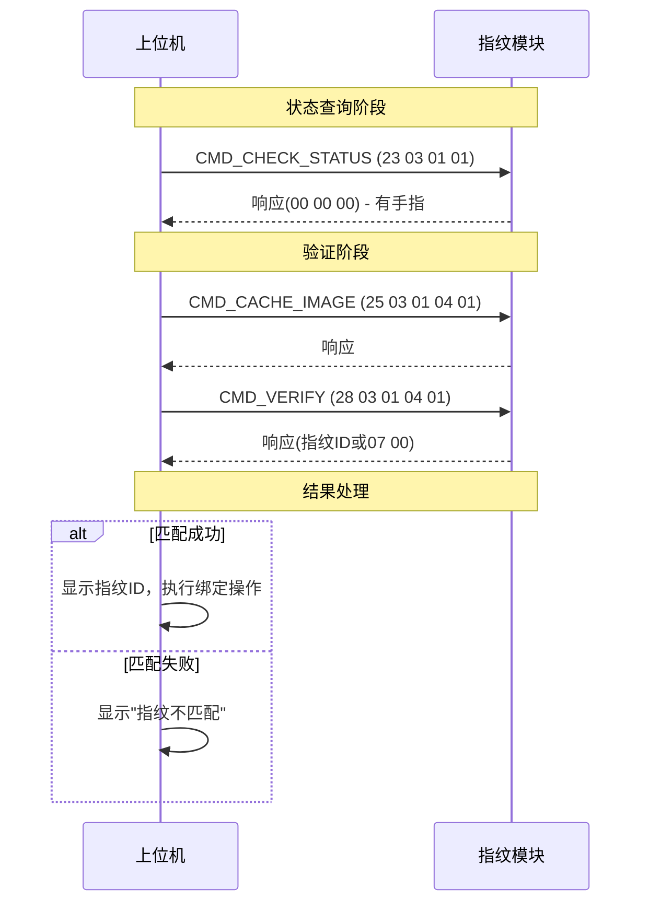
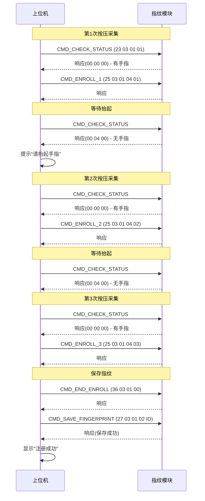
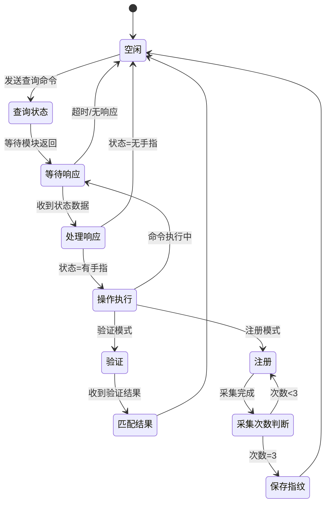

# 指纹模组串口通信协议规格书

## 1. 概述

本文档描述了上位机与指纹模块之间的串口通信协议，适用于基于 UART 接口的光学指纹模组（如 R30X 系列、FPM 系列）。

### 1.1 协议特点

- 基于十六进制字节流传输
- 采用主从问答模式
- CRC16-CCITT 校验
- 模块地址固定为 `FF FF FF FF FF FF FF FF`

---

## 2. 物理层参数

| 参数 | 值 |
|------|-----|
| 波特率 | 9600 bps |
| 数据位 | 8 位 |
| 停止位 | 1 位 |
| 校验位 | 无 (N) |
| 流控制 | 无 |

---

## 3. 数据帧格式

### 3.1 通用帧结构

```
┌─────────┬─────────┬─────────┬──────────┬─────────┬─────────┬────────┬────────┐
│  包头   │  地址   │  长度   │  功能码  │  参数   │  数据   │  CRC   │  结尾  │
│  2B     │  8B     │  2B     │   2B     │   2B    │   N B   │   2B   │  2B    │
└─────────┴─────────┴─────────┴──────────┴─────────┴─────────┴────────┴────────┘
```

### 3.2 字段说明

| 字段 | 长度 | 说明 | 示例 |
|------|------|------|------|
| 包头 | 2B | 固定为 `EF 02` | `EF 02` |
| 地址 | 8B | 模块地址，固定 `FF` 填充 | `FF FF FF FF FF FF FF FF` |
| 长度 | 2B | 从功能码到数据区的字节数（不含 CRC 和结尾） | `00 0D` = 13 |
| 功能码 | 2B | 命令类型 | `23 03` |
| 参数 | 2B | 命令子类型 | `01 01` |
| 数据区 | N B | 可选参数 | `00 00` |
| CRC | 2B | CRC16-CCITT 校验 | `XX XX` |
| 结尾 | 2B | 固定 `0A 0D` | `0A 0D` |

### 3.3 长度字段计算

```
长度 = 功能码(2) + 参数(2) + 数据区(N) + 预留(1) = 5 + N
```

例如：唤醒命令 `00 00 23 03 01 01 00 00 3F 3B`
- 功能码: `23 03`
- 参数: `01 01`
- 数据: `00 00`
- 长度 = 2 + 2 + 2 = 6 = `00 06`

---

## 4. 命令集

### 4.1 命令汇总表

| 序号 | 功能 | 功能码 | 参数 | 数据区 | 响应说明 |
|------|------|--------|------|--------|----------|
| 1 | 唤醒模块 | `23 03` | `01 01` | 无 | 返回模块状态 |
| 2 | 休眠模块 | `90 03` | `01 02` | 无 | 返回确认 |
| 3 | 获取指纹状态 | `23 03` | `01 01` | 无 | 返回传感器状态 |
| 4 | 特征采集 | `25 03` | `01 04` | 采集序号(1B) | 返回采集结果 |
| 5 | 指纹注册 | `27 03` | `01 02` | 指纹ID(1B) | 返回注册结果 |
| 6 | 指纹验证 | `28 03` | `01 04` | 匹配序号(1B) | 返回匹配结果 |
| 7 | 删除全部指纹 | `2A 03` | `01 00` | 无 | 返回删除结果 |
| 8 | 结束录入 | `36 03` | `01 00` | 无 | 返回确认 |

### 4.2 详细命令格式

#### 4.2.1 唤醒模块

```
发送: EF 02 FF FF FF FF FF FF FF FF 00 00 23 03 01 01 00 00 3F 3B
响应: EF 02 FF FF FF FF FF FF FF FF 00 00 23 03 01 01 00 00 3F 3B
```

#### 4.2.2 休眠模块

```
发送: EF 02 FF FF FF FF FF FF FF FF 00 00 90 03 01 02 00 00 00 12 09
响应: EF 02 FF FF FF FF FF FF FF FF 00 00 90 03 01 02 00 00 00 12 09
```

#### 4.2.3 获取指纹状态

```
发送: EF 02 FF FF FF FF FF FF FF FF 00 00 23 03 01 01 00 00 3F 3B

响应(有手指且接触良好):
  EF 02 FF FF FF FF FF FF FF FF 00 00 23 03 02 02 00 00 00 36 CD

响应(无手指或接触不良):
  EF 02 FF FF FF FF FF FF FF FF 00 00 23 03 02 02 00 04 00 F2 01
```

#### 4.2.4 特征采集 (第1次)

```
发送: EF 02 FF FF FF FF FF FF FF FF 00 00 25 03 01 04 00 01 00 00 00 C2 4F
响应: (根据采集结果返回)
```

#### 4.2.5 特征采集 (第2次)

```
发送: EF 02 FF FF FF FF FF FF FF FF 00 00 25 03 01 04 00 02 00 00 00 1E D4
响应: (根据采集结果返回)
```

#### 4.2.6 特征采集 (第3次)

```
发送: EF 02 FF FF FF FF FF FF FF FF 00 00 25 03 01 04 00 03 00 00 00 AA A2
响应: (根据采集结果返回)
```

#### 4.2.7 结束录入

```
发送: EF 02 FF FF FF FF FF FF FF FF 00 00 36 03 01 00 00 EC C6
响应: (根据结果返回)
```

#### 4.2.8 指纹注册 (带 CRC 计算)

```
发送格式: EF 02 FF FF FF FF FF FF FF FF [长度] 27 03 01 02 00 [指纹ID] 00 [CRC低] [CRC高] 0A 0D

示例 (指纹ID=1):
  EF 02 FF FF FF FF FF FF FF FF 00 06 27 03 01 02 00 01 00 5A 30 0A 0D
```

#### 4.2.9 指纹验证

```
发送(缓存图像): EF 02 FF FF FF FF FF FF FF FF 00 00 25 03 01 04 00 01 00 00 00 C2 4F
发送(验证匹配): EF 02 FF FF FF FF FF FF FF FF 00 00 28 03 01 04 00 01 00 00 00 F1 11

响应(匹配成功):
  ... 00 00 00 [指纹ID] 00 [其他数据]
  
响应(匹配失败):
  ... 00 07 00 00 00 00 00 [校验]
```

#### 4.2.10 删除全部指纹

```
发送: EF 02 FF FF FF FF FF FF FF FF 00 00 2A 03 01 00 00 9D 49
响应: (根据删除结果返回)
```

---

## 5. 响应状态码

### 5.1 指纹状态码

| 状态码 | 含义 | 响应位置 |
|--------|------|----------|
| `00 00 00` | 手指按下且接触良好 | 数据区第1-3字节 |
| `00 04 00` | 无手指或接触不良 | 数据区第1-3字节 |

### 5.2 操作结果码

| 状态码 | 含义 |
|--------|------|
| `00 00` | 成功 |
| `01 00` | 接收错误 |
| `02 00` | 采集失败 |
| `03 00` | 特征点不足 |
| `07 00` | 指纹不匹配 |

---

## 6. 交互流程

### 6.1 指纹验证流程



### 6.2 指纹注册流程



### 6.3 状态机图



---

## 7. CRC 校验算法

### 7.1 CRC16-CCITT 说明

- 多项式: `0x1021`
- 初始值: `0x0000`
- 输入反转: 否
- 输出反转: 否

### 7.2 C 语言实现

```c
uint16_t crc16_ccitt(const uint8_t *data, uint16_t length) {
    uint16_t crc = 0x0000;
    uint16_t polynomial = 0x1021;
    
    for (uint16_t i = 0; i < length; i++) {
        crc ^= (uint16_t)(data[i]) << 8;
        for (uint8_t j = 0; j < 8; j++) {
            if (crc & 0x8000) {
                crc = (crc << 1) ^ polynomial;
            } else {
                crc <<= 1;
            }
            crc &= 0xFFFF;
        }
    }
    return crc;
}
```

### 7.3 Python 实现

```python
def crc16_ccitt(data):
    """计算 CRC16-CCITT 校验码"""
    crc = 0x0000
    polynomial = 0x1021
    for byte in data:
        crc ^= (byte << 8)
        for _ in range(8):
            if crc & 0x8000:
                crc = (crc << 1) ^ polynomial
            else:
                crc <<= 1
            crc &= 0xFFFF
    return crc
```

### 7.4 CRC 计算示例

以注册命令为例，计算指纹 ID=1 的 CRC：

```python
# 输入数据
data = [0xEF, 0x02, 0xFF, 0xFF, 0xFF, 0xFF, 0xFF, 0xFF, 0xFF, 0xFF,
        0x00, 0x00, 0x27, 0x03, 0x01, 0x02, 0x00, 0x01, 0x00]

# 计算 CRC
crc = crc16_ccitt(data)
# CRC = 0x305A

# 最终命令
# EF 02 FF FF FF FF FF FF FF FF 00 00 27 03 01 02 00 01 00 5A 30 0A 0D
```

---

## 8. 超时与重试机制

### 8.1 超时参数

| 操作 | 超时时间 | 说明 |
|------|----------|------|
| 命令发送 | 100ms | 单字节发送间隔 |
| 响应等待 | 3000ms | 等待模块响应 |
| 状态查询 | 300ms | 轮询间隔 |

### 8.2 重试策略

1. **首次失败**: 延迟 500ms 后重试
2. **连续失败**: 提示"模块无响应，请按压唤醒"
3. **注册超时**: 提示"采集超时，请重新按压"

---

## 9. 错误处理

### 9.1 通信错误

| 错误类型 | 处理方式 |
|----------|----------|
| 串口打开失败 | 提示"串口未连接" |
| 发送失败 | 重试3次后提示"发送失败" |
| 接收超时 | 提示"模块无响应" |
| CRC 校验失败 | 丢弃数据，请求重发 |

### 9.2 模块错误

| 模块返回码 | 含义 | 处理方式 |
|------------|------|----------|
| `01 00` | 接收错误 | 重新发送命令 |
| `02 00` | 采集失败 | 提示"请重新按压" |
| `03 00` | 特征点不足 | 提示"手指按压力度不足" |
| `07 00` | 验证失败 | 提示"指纹不匹配" |

---

## 10. 附录

### 10.1 命令快速参考表

| 功能 | 完整命令 (HEX) |
|------|----------------|
| 唤醒/状态查询 | `EF 02 FF FF FF FF FF FF FF FF 00 00 23 03 01 01 00 00 3F 3B` |
| 休眠 | `EF 02 FF FF FF FF FF FF FF FF 00 00 90 03 01 02 00 00 00 12 09` |
| 采集第1次 | `EF 02 FF FF FF FF FF FF FF FF 00 00 25 03 01 04 00 01 00 00 00 C2 4F` |
| 采集第2次 | `EF 02 FF FF FF FF FF FF FF FF 00 00 25 03 01 04 00 02 00 00 00 1E D4` |
| 采集第3次 | `EF 02 FF FF FF FF FF FF FF FF 00 00 25 03 01 04 00 03 00 00 00 AA A2` |
| 结束录入 | `EF 02 FF FF FF FF FF FF FF FF 00 00 36 03 01 00 00 EC C6` |
| 验证 | `EF 02 FF FF FF FF FF FF FF FF 00 00 28 03 01 04 00 01 00 00 00 F1 11` |
| 删除全部 | `EF 02 FF FF FF FF FF FF FF FF 00 00 2A 03 01 00 00 9D 49` |

### 10.2 响应状态快速参考

| 响应字段 | 含义 |
|----------|------|
| `23 03 02 02 00 00 00 36 CD` | 手指按下，接触良好 |
| `23 03 02 02 00 04 00 F2 01` | 无手指或接触不良 |
| `28 ... 00 00 00 XX ...` | 验证成功，指纹ID=XX |
| `28 ... 00 07 00 00 ...` | 验证失败 |

---

**文档版本**: v1.0  
**创建日期**: 2026-04-03  
**适用模组**: R30X 系列 / FPM 系列光学指纹模块